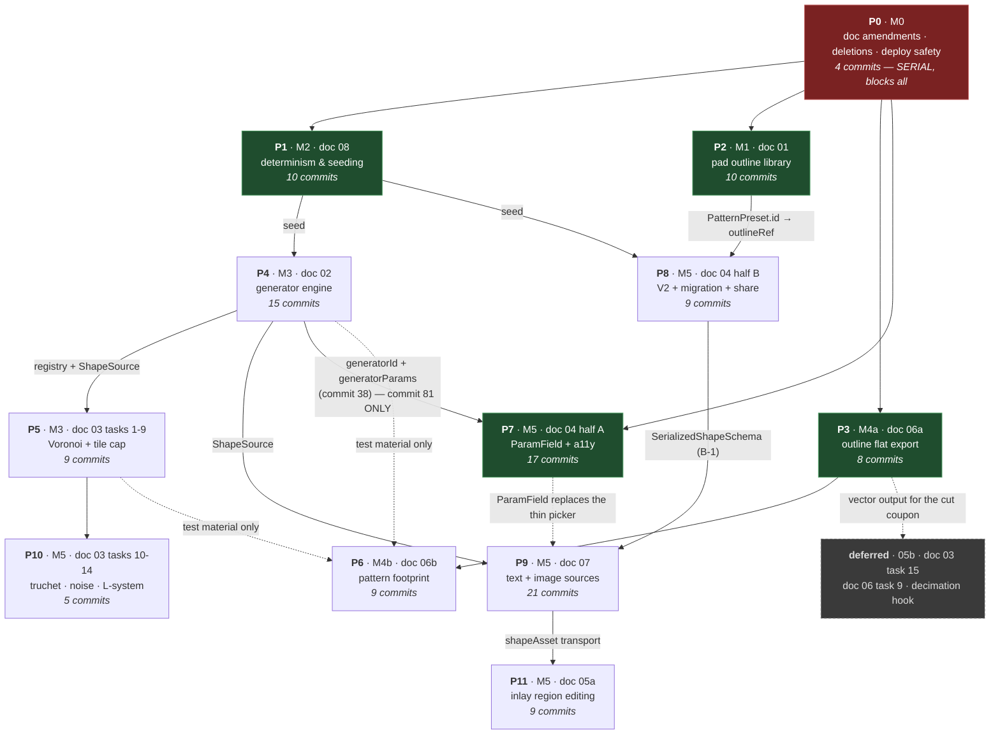

# GripSmith Implementation Plan

**Status:** execution order of record. Written 2026-09-04.
**Branch:** `gripsmith` (`git branch -a` → `* gripsmith`, `master`, `remotes/upstream/master`).
**Scope:** every numbered task in the eight design docs, sequenced into 126 commits across 12 phases.

This document is **not** a specification. The eight design docs in `docs/` are the specification; they
carry the evidence, the file:line citations, the acceptance criteria and the edge cases. This document
carries only the **order**, the **commit boundaries**, the **verification command for each commit**, and
the rules that apply to every commit regardless of which doc it serves.

**Read the doc a task cites before implementing that task.** The task rows below are pointers, not
substitutes. Where this plan and a design doc disagree, **the design doc wins**. Where two design docs
disagree, [`00-architecture.md`](./00-architecture.md) wins (its §10 states this, and every child doc
repeats it). Where the architecture doc and a decision of record (§ "The decisions of record"
below) disagree, the decision wins — it *is* the amendment, and phase P0 writes it into the doc.

## Verified baseline

Measured on this tree at branch tip, before any commit in this plan:

| Gate | Command | Result |
|---|---|---|
| Tests | `pnpm test` | **21 files / 162 tests, all passing**, ~2.9–4.5 s. Manifold wasm runs under Vitest/jsdom. |
| Build | `pnpm build` | **exit 0.** 1,850.77 kB JS / 531.65 kB gzip in one unsplit chunk; `manifold-*.wasm` 541.47 kB; `geometryWorker-*.js` 130.66 kB; `index-*.css` 38.12 kB. (`docs/_source/baseline-verification.md:73-76`) |
| Lint | `pnpm lint` | exit 0 with **42 warnings, 0 errors**. No rule written *literally* in `eslint.config.js:20-38` is severity `'error'` — and two are `'off'`, not `'warn'`: `@typescript-eslint/no-explicit-any` (`:26`) and `no-empty` (`:38`), so `any` and empty blocks produce no signal at all. **But lint CAN fail.** `eslint.config.js:10` extends `js.configs.recommended` (measured: **61** error-severity rules) and `:21` spreads `reactHooks.configs.recommended.rules`, which sets `react-hooks/rules-of-hooks: 'error'` (measured). Treat the 42-warning count as a drift signal; treat a **non-zero exit** as a real failure (cross-cutting rule 20). |
| Typecheck | `npx tsc -p tsconfig.app.json --noEmit` | **18 pre-existing errors**: 12 × TS6133, 1 × TS6192, 4 × TS2304, 1 × TS2322. There is **no** `typecheck` script and `"build": "vite build"` (`package.json:9`) does **not** typecheck. |
| Repo | `git status --short` | Three untracked entries: `?? CLAUDE.md`, `?? HANDOFF.md`, `?? docs/`. `src/` is **tracked and clean** (`git ls-files src/` → 86 files; 150 tracked files in total, all upstream's) and byte-identical to `upstream/master`. Branch `gripsmith` already carries the full upstream history (`git rev-list --count HEAD` → **78**); this plan's commits **extend** it — commit 1 is the fork's first divergence, not an initial commit. **Stage explicitly — `git add <the Files cell's paths>` — never `git add -A`**, or `CLAUDE.md` and `HANDOFF.md` land in commit 1. |
| Remotes | `git remote -v` | `upstream` only. **No `origin`.** `pnpm deploy:gh` (`package.json:12`) fails until one exists. |

**Phase P0 changes the test count.** Deleting `src/utils/offsetUtils.test.ts` (7 tests, at `:24`, `:31`,
`:44`, `:54`, `:81`, `:85`, `:99`; no `.each`, no loops, so the count cannot vary) takes the suite to
**20 files / 155 tests**. Root `00-architecture.md:386` still states the M0 exit gate as "21 files /
162 tests"; that figure is arithmetically impossible after the deletion M0 itself mandates, and commit 1
corrects it. Every gate from commit 3 onward is **20/155 + whatever that commit adds**.

Deleting `offsetUtils.test.ts` does **not** change the tsc count: none of the 18 errors are in that file.
The typecheck baseline stays 18 across all of P0.

---

## How to use this plan

You are implementing one commit at a time, from a repo you have never seen. The loop is:

1. **Read** the doc section the commit's row cites. Read the whole section, not the row.
2. **Implement** exactly that task. One task = one commit. Do not batch, do not run ahead.
3. **Verify** with the commit's Verify cell. Every cell is runnable as written.
4. **Commit** with the message in the row.

### Environment

Every command in this document needs Homebrew on `PATH` — required for `pnpm`, `node` and `npx`. It is **not**
required for `git`: there is no Homebrew git on this machine (`ls /opt/homebrew/bin/git` → no such file) and
`git` resolves to Apple Git at `/usr/bin/git`.

```sh
export PATH="/opt/homebrew/bin:$PATH"
cd /Users/ldev/workspaces/imminentlatency/gripsmith
```

**REQUIRED before commit 1 — set a git identity.** `git config user.name` and `git config user.email` are unset
at every level (both exit 1). **git does not refuse; it silently guesses.** Measured here:
`git var GIT_AUTHOR_IDENT` → `Liam Thompson <ldev@Liams-MacBook-Air.local>`, exit 0, and a scratch
`git init` + `git commit` succeeds with that author. Every one of the 126 commits would carry an unroutable
`.local` address that GitHub cannot attribute, **no gate in this plan inspects authorship**, and the only fix
afterwards is a history rewrite.

```sh
git config user.name  "<your name>"
git config user.email "<your email>"
git var GIT_AUTHOR_IDENT        # must echo what you just set, not <user>@<hostname>.local
```

Toolchain: pnpm 10.20.0 · Vite 5.4.21 · Vitest 2.1.9 · Tailwind 3.4.19 · zod 4.2.0 · React 19.2 with
the React Compiler **on** (`vite.config.ts:8-14`). Units are millimetres in three.js scene units at
1 unit = 1 mm.

### The standard gate — `GATE`

Wherever a Verify cell says `GATE`, run this. It is referenced by name only to keep the tables readable;
substitute it literally.

```sh
export PATH="/opt/homebrew/bin:$PATH"
pnpm test          # must be green
pnpm build         # must exit 0
pnpm lint          # must exit 0 — see cross-cutting rule 20; 42 warnings are noise, non-zero is not
npx tsc -p tsconfig.app.json --noEmit 2>&1 | grep 'error TS' \
  | sed -E 's/\(([0-9]+),([0-9]+)\)//' | LC_ALL=C sort > /tmp/tsc-after-$PHASE.txt
diff /tmp/tsc-before-$PHASE.txt /tmp/tsc-after-$PHASE.txt    # must be empty
```

`/tmp/tsc-before-$PHASE.txt` is captured **once per phase**, on the commit *before* the first type-touching
commit of that phase. `$PHASE` is the phase id (`p0`…`p11`): wave 1 runs four concurrent agents and wave 3
three, and a single hardcoded `/tmp/tsc-before.txt` would have them clobber each other's baseline.

```sh
export PHASE=p1     # set once, per phase, per agent
npx tsc -p tsconfig.app.json --noEmit 2>&1 | grep 'error TS' \
  | sed -E 's/\(([0-9]+),([0-9]+)\)//' | LC_ALL=C sort > /tmp/tsc-before-$PHASE.txt
```

**Line and column are stripped deliberately.** `tsc` embeds `(line,col)` in every message
(`src/components/ModelViewer.tsx(89,10): error TS6133: …`), so inserting a line anywhere *above* a
pre-existing error changes its text and fails an un-normalised diff on a correct commit. This happens at
**P1 commit 12** (edits `ModelViewer.tsx:48-54`, above the error at `ModelViewer.tsx(89,10)`), **P3 commit 32**
and **P6 commit 65** (edit `OutputPanel.tsx:9-13`, above `OutputPanel.tsx(125,28)`), and **P2 commit 20**
(adds an import to `DXFThumbnail.tsx`, above `DXFThumbnail.tsx(12,59)`). File + error code + message is the
stable identity; the position is not.

**The sort locale is pinned deliberately too.** `en_US.UTF-8` and `C` collate case differently — `C` puts `Controls.tsx` before
`controls/…`, `en_US` interleaves them, and both are in the 18-error baseline — so a baseline captured in one shell and diffed in
another shows the same 18 lines as a full rewrite (observed 2026-09-10 on P0's untouched tree). `LC_ALL=C sort`, both sides, always.

**Gate on the diff, never on a count.** The count is 18 today; `docs/_source/baseline-verification.md`
records 19 and the recon report's errata (`docs/_source/00-recon-report.md`, errata block) corrects it to
18. Neither number is worth a failed gate. Doc 07 §7 task 12 specifies this same mechanism verbatim; it is
promoted here to a global rule.

`pnpm build` exiting 0 is **necessary but proves nothing about types** — `vite build` strips types with
esbuild and never runs `tsc`. It does, however, prove that every dynamic `import()` specifier resolves,
which is a real gate (see cross-cutting rule 14).

---

## The decisions of record

*(D1–D4 are @liamstar's four rulings of 2026-09-04. **D5 is an editorial resolution made by this plan**, not
one of his — it is `docs/README.md`'s row 4, which README itself gates as "wording only; no code is blocked".)*

D1–D4 were resolved **2026-09-04** by @liamstar. D5 is an editorial resolution made by this plan, not a
@liamstar ruling — see its own section. They are recorded here because **the docs still carry them as open
questions** until phase P0's doc-edit commits land. An implementing agent who reads only the repo will hit
**ten** blocking markers, every one of which was opened and confirmed on disk:

`docs/02-generator-engine.md:4`, `:55`, `:132`, `:255`, `:480`; `docs/03-generators.md:54`, `:175`, `:621`,
`:640`, `:672`; `docs/04-parametric-controls.md:296`; and `docs/05-direct-editing.md:371-397` question 6.
(`02-generator-engine.md:55` and `:132` are the two "**@liamstar's call**" divergences from root §5.1 that D5
resolves; earlier drafts of this plan listed seven markers and omitted them. **Verify P0 commit 2 by
re-reading each of the ten, not by counting.**)

Those markers are correct as of the untouched tree and wrong as of this plan. **P0 exists to close that gap;
it is why P0 is first.**

### D1 — Root §5.2 rule 5: main-thread generation carve-out **ADOPTED**

Generation runs on the **main thread**, in the null-rendering `GeneratorRunner` doc 02 §4.1 specifies.
Doc 02 §4.5's deviation is accepted. **No fourth worker message kind, no second worker.**

Rationale of record:

- Generators are plain JS and need no wasm; a generator-only worker would either duplicate the
  541,470-byte `manifold.wasm` compile (`src/utils/geometry/manifoldModule.ts:15`, `:17-27` memoize the
  module promise **per realm**) or buy nothing over the main thread.
- `patternUnit` is assembled on the main thread in `buildJob` (`src/components/ImperativeModel.tsx:825-861`),
  so worker-side generation is **two** structured-clone round trips with a redundant
  deserialize/reserialize in the middle (`src/utils/geometry/serialize.ts:61` on the way back, then
  `serializeShapes` again at `ImperativeModel.tsx:836`).
- The measured cost centres are Manifold booleans and `computeSharpNormals`
  (`src/utils/geometry/normals.ts:26` via `src/utils/geometry/manifoldOps.ts:217`), **not** polygon
  arithmetic.
- Not widening the job-kind union avoids adding exposure to the DataCloneError wedge at
  **`src/utils/geometry/patternClient.ts:66-67`** — note the full path; there is no
  `src/utils/patternClient.ts`.

**Reversible per-generator** on doc 02 §4.5's trigger: any generator whose `generate()` exceeds **50 ms**
at its documented maximum complexity, measured with `performance.now()` around step 4 of `runGenerator`.

**Unblocks:** doc 02 task 1, therefore all of M3. Doc 02's status changes from "Draft — blocked" to
"Ready to implement"; its §7 "Task 0" paragraph is deleted.

### D2 — Root §5.2 rule 2: narrow `insetConvex` carve-out **ADOPTED**

Permitted: a **convex-only, generator-internal** inward offset used **solely** to open gaps between
Voronoi cells, subject to all four of doc 03 §8 Q6's conditions — asserts convexity and throws in dev /
drops the ring in prod; exact (edge-line shift + intersect), not approximate; collapse detected via
`THREE.ShapeUtils.area` ≤ 0 and counted in `GeneratorOutput.clamps`; never applied to pipeline output.

**Not permitted:** any general-purpose offset or clip utility, anything exported outside
`src/utils/generators/poly.ts`, anything under `src/utils/geometry/`, anything applied to non-convex input.

Rationale: rule 2 exists to stop re-implementation of the CSG engine. The alternative — `CrossSection.offset`
(`src/utils/geometry/manifoldOps.ts:151`) — is worker-only, and reaching it from the main thread
instantiates a second wasm realm, contradicting D1.

**Unblocks:** doc 03 task 2. Doc 03 §8 Q6 is marked resolved and the four blocked markers at
`docs/03-generators.md:54`, `:175`, `:621`, `:640` are struck.

### D3 — Persistence for source-less geometry: **doc 07 §4.5's zip asset SHIPS**

The winner is doc 07 §4.5's synthetic `<name>.shapes.json` zip entry via `serializeShapeAsset` /
`parseShapeAsset` in `src/utils/sources/shapeAsset.ts` **(new)**.

**STRUCK, and marked struck in their own docs by P0:**

| Struck | Where | What replaces it |
|---|---|---|
| The **entire** `ProjectSchemaV2.shapes` block — `cutoutShapes`, `patternShapes` **and** `inlayShapes` | `docs/04-parametric-controls.md:325-330` (the block itself), `:365`, `:385`, `:386`, `:387`, `:388` | doc 07 §4.5's zip asset |
| `InlayItemSchema.editedShapes` | `docs/05-direct-editing.md:114` (§4.3), tasks **T5–T8** | doc 07 §4.5's zip asset |
| doc 04 **I7 / E10** — the export-side missing-asset relaxation | `docs/04-parametric-controls.md:512`, `:536`, `:560`, `:652` | **No edit needed.** I7's premise was "the check stops counting an inlay as missing once its geometry is written to `shapes.inlayShapes[item.id]`" — struck by D3. Under the surviving mechanism the check already works: the push at `src/components/Controls.tsx:137` is gated on `item.shapes && item.shapes.length > 0` (`:135`) **and** `!projectAssets.inlays \|\| !projectAssets.inlays[item.id]` (`:136`), which P9 commit 106's asset registration satisfies by itself. **Do not "relax" `:136`** — it would suppress a legitimate warning for inlays with genuinely missing assets |

Rationale: geometry stays out of `project.json`; the existing import path already distrusts inline JSON
geometry (`src/components/Controls.tsx:222` — "JSON shapes are garbage") and re-parses zip assets, so the
asset form matches the shipped architecture; and it keeps doc 04's URL share references-and-scalars only.
It is also the only mechanism that covers the **pattern** lane (doc 07 §4.5a) — the two inline mechanisms
are inlay-only as drafted.

**`SerializedShapeSchema` is declared EXACTLY ONCE**, in `src/types/schemas.ts`, by **doc 04 task B-1**
(doc 04 owns the schema file). Docs 05 and 07 **import** it. `grep -rn 'SerializedShapeSchema' src/`
returns zero today, so this is a greenfield write, not a de-duplication.

**`ProjectSchemaV2` still ships** in doc 04 (task B-1) — but its **whole** inline-geometry `shapes` block is
struck, not just `inlayShapes`. Nothing is lost: `cutoutShapes` already travels as a raw zip asset
(`src/utils/projectUtils.ts:61-63`) and `patternShapes` travels as P9 commit 110's `<name>.shapes.json`
asset (`:66`). Every commit that acts on this agrees — P8 commit 83 "ships WITHOUT the `shapes` block",
P8 commit 86 "No `shapes` block is written", P8 commit 87 "the `shapes` middle term is struck".
The working migration (B-2), the import-first ordering (B-3) and the `inlay: {...inlay}` live-shape leak
fix at `src/utils/projectUtils.ts:48-50` (B-4) are unaffected and still required.

**`PersistedShapeSchema` keeps its declaration but changes consumer.** It is
`z.object({ shape: SerializedShapeSchema, color: z.string().optional() })`
(`docs/04-parametric-controls.md:314-317`) and its only use in the doc set was inside the struck block
(`:329`). It is **not** dead code: doc 07 §4.5's payload is structurally identical —
`SerializedShapeAsset.shapes: Array<{ shape: SerializedShape; color?: string }>`
(`docs/07-text-image-sources.md:229-233`) — so **P9 commit 102's asset element *is* `PersistedShapeSchema`**
and must import it rather than re-declare `{ shape, color? }`. Colour is load-bearing, not decorative:
`src/utils/shapeLoader.ts:53` emits `{ shape: s, color: color || '#000000' }` and
`src/components/Controls.tsx:210` rehydrates inlays with `extractColors = true`, so a painted inlay's
per-shape colours must survive the round trip.

**Consequence — hard prerequisite.** Doc 07 E12's `fileTypeSniffer` fix becomes a **hard prerequisite**,
not an optimisation. `detectAssetType` is declared `(buffer, fileName): 'stl' | 'dxf' | 'svg'`
(`src/utils/fileTypeSniffer.ts:3`). A `<name>.shapes.json` entry matches no extension branch (`:6-8`),
no content branch (`{` is not `<`, not `solid`, not `SECTION`/`0`/`999` — `:22-24`), and is not binary
(`:30-36`), so it falls to the unconditional `return 'dxf'` at `:39` and is handed to the DXF parser.
**The failure is silent — misrouted, not rejected.** Doc 07 task 13 must land strictly before tasks 14,
15 and 19.

**Consequence — supersede, not coexist.** `ProjectAssets.inlays` is `Record<string, Asset>` — exactly
**one asset slot per inlay id** — on export (`src/utils/projectUtils.ts:69-73`), on import
(`:154-166`, `assets.inlays[id] = asset` at `:165`) and in the registration handler
(`src/components/Controls.tsx:105-115`, `newInlays[id] = asset`). Registering a `.shapes.json` asset for
an inlay that already had a source SVG/DXF/STL therefore **replaces** that source asset. That is
resolution **(a)** of doc 05 §8 question 2 ("Should `editedShapes` supersede the source asset, or diff
against it?") and it is adopted: **edited geometry supersedes the source; the original file is
intentionally not retained across a round trip.** Doc 05's §4.3 case (an inlay that *has* a source and
was then hand-edited) is declared covered by doc 07 §4.5 with that documented loss. P0 records this in
doc 07 §4.5 so its "no source file" scope line no longer excludes the case it now owns. A
"Revert to source" affordance would require widening `ProjectAssets.inlays` beyond one slot per id and is
**out of scope** (see Deferred).

### D4 — Doc 08 stays a separate doc

No merge into 02 or 00. `docs/08-determinism-and-seeding.md` is the owner of the PRNG, the two schema
`seed` fields, `PatternJob.seed` and the tiler's 14th parameter. Nothing else declares a seed.

### D5 — The two doc-02 wording divergences from root §5.1 — **editorial, not a @liamstar ruling**

**This is `docs/README.md`'s "Decisions outstanding" row 4, and it is NOT D4.** README's row 4 is *"Two
smaller doc-02 divergences from root §5.1: where `ShapeSource` lives, and whether 'generalise
`generateTilePositions`' is the right wording for `Generator<P>`"* (`docs/README.md:106`), with the Gates
column reading **"wording only; no code is blocked"**. D4 (doc 08 stays separate) appears nowhere in README.
Earlier drafts of P0 commit 2 would have dated all four README rows resolved by @liamstar on 2026-09-04 —
including this one, which was never put to him. **It must not be stamped as his.**

Both divergences are live markers on disk that end *"@liamstar's call"*:

- **`docs/02-generator-engine.md:132`** — where `ShapeSource` lives. Root §5.1's `ShapeSource` row
  (`docs/00-architecture.md:252`) ends *"Define it beside `src/utils/shapeLoader.ts:12`."* Doc 02 §4.2 places
  it in `src/utils/generators/types.ts` and says *"Root §5.1 wins until amended."*
- **`docs/02-generator-engine.md:55`** — whether `generateTilePositions` is "the existing parametric engine to
  generalise". Root §5.1's `Generator<P>` row (`docs/00-architecture.md:253`) says it is; doc 02 leaves the
  tiler untouched and a `Generator` synthesises only the **unit**.

**Resolution adopted by this plan (editorial):** amend root §5.1 to match what this plan actually builds.
P4 commit 33 creates `src/utils/generators/types.ts`, and P5's entire layout assumes it — the plan has
already committed to doc 02's placement, so leaving root §5.1 unamended is a self-contradiction, not a
preserved option. `src/utils/generators/` is inside the `src/utils/**` coverage allowlist
(`vite.config.ts:30-35`), so nothing is lost, and it keeps the framework in one new folder per rule 6.
P0 commit 1 makes both root §5.1 amendments; P0 commit 2 strikes the two "@liamstar's call" sentences.

**If @liamstar prefers otherwise**, only one thing changes: the path in P4 commit 33 and every import of it.
Say so before P4 starts. This is recorded as editorial precisely so the reversal stays cheap.

---

## Cross-cutting rules

These apply to **every** commit. Each one fails **silently** — that is why they are here rather than in a
doc appendix.

| # | Rule | Anchor | What breaks if you skip it |
|---|---|---|---|
| 1 | **Never reformat.** No Prettier, no EditorConfig; indentation is mixed across files and *within* `src/utils/geometry/patternPipeline.ts`. | `00-architecture.md` §5.2 rule 6, last line | Unreviewable diffs; rule 6 mergeability lost |
| 2 | **Every new field on `BaseSettingsSchema`, `InlaySettingsSchema` or `GeometrySettingsSchema` needs `.default()`.** `getDefaults` is `schema.parse({})` (`src/utils/schemaDefaults.ts:7`) called in three **top-level consts** (`:10-12`), imported by `src/App.tsx:9` and by `schemaDefaults.test.ts:3` / `projectUtils.test.ts:3`. | `src/utils/schemaDefaults.ts:7`, `:10-12` | Module-load-time throw. Verified live on zod 4.2.0: a required `seed: z.number()` makes `parse({})` throw `invalid_type … path=["seed"]`. App and suite die together. **Assert on `getDefaults(...)` directly — do not accept "tests pass".** |
| 3 | **zod 4.2.0 does not validate inside a `.default([…])` array.** A field required on `InlayItemSchema` but absent from the `items` default literal (`src/types/schemas.ts:51-63`) does **not** throw — it is `undefined` at runtime while the inferred `InlayItem` type (`:48`) declares it present. | `src/types/schemas.ts:51-63`, `:19-46`, `:48` | Silent `undefined` in arithmetic or a PRNG seed, with no type error and no failing test. **Green is what this failure looks like.** Edit the literal in the same commit. Doc 08 §4.4 documents this case and its task 4 requires `seed: 1` in the literal. |
| 4 | **The seven-hop param chain.** Schema → `App.tsx` → `Controls.tsx` → `ModelViewer` destructure (`:48-54`) → **`ModelViewer` JSX attribute (`:460-501`)** → `ImperativeModelProps` (`:15-54` + body `:60-96`) → `buildJob` (`:825-861`) → `PatternJob` (`patternPipeline.ts:51-82`) → **dependency array (`ImperativeModel.tsx:897-903`)**. | `00-architecture.md` §5.2 rule 6 table | The JSX attribute is "the step most often missed" — the field never crosses into `ImperativeModel`. A field omitted from the dep array **never triggers regeneration** (already demonstrably broken for the three `debugShow*Cutter` props). Copy `rotationClamp` hop for hop: `schemas.ts:83` → `ModelViewer.tsx:52`, `:480` → `ImperativeModel.tsx:33`, `:80`, `:848`, `:900` → `patternPipeline.ts:66` (**`:66`, not `:73`**), `:111`, `:193-195`. |
| 5 | **The structured-clone wedge.** `pump()` assigns `this.inFlight = next` **before** `postMessage`, with no try/catch, after nulling the pending slot on the line above. | `src/utils/geometry/patternClient.ts:65`, `:66-67`, guard at `:61` | A `DataCloneError` throws out of the effect and **every later submission returns at `if (this.inFlight) return` — all geometry generation is permanently wedged for the session**, spinner stuck on (`ImperativeModel.tsx:811`, cleared only at `:880`/`:890`). No timeout, no `terminate()`. Never put a `THREE.Shape`, class instance, function or `Date` in a job. **Assert `structuredClone(job)` in a test.** |
| 6 | **Worker failure is silent.** The catch posts an *empty result*, which resolves the callback and clears the spinner. `PatternResult.empty` is set at four sites and **read by nobody**. `worker.onerror` clears `inFlight` and pumps the next job into a dead worker. | `src/workers/geometryWorker.ts:34-50`; `patternClient.ts:42-47`, `:52-58` | The pattern just vanishes. Any new kind must surface failure through `AlertContext` (`src/context/AlertContext.tsx:20`; precedent `src/components/controls/BaseControls.tsx:86-90`). |
| 7 | **Rings need ≥ 3 vertices.** `points.length < 6` is silently dropped. | `src/utils/geometry/manifoldOps.ts:86`, also `:93`, `:132` | No error, no `empty` signal a consumer reads. |
| 8 | **Track and flush every wasm object; never cache objects from an unbounded per-shape loop.** `WasmCache` eviction calls `delete()` on the victim. | `manifoldOps.ts:49-72`; flush at `patternPipeline.ts:369-371`; `manifoldCache.ts:94-105`, `:125-131` | Real use-after-free, with a dedicated regression test at `patternPipeline.test.ts:162-182`. |
| 9 | **`pnpm build` does not typecheck.** No `typecheck` script exists. Gate on the **line/column-normalised** `diff` against a captured error list, never on a count (18 today; the baseline file says 19 and is stale). `tsc` embeds `(line,col)` in every message, so an un-normalised diff false-fails on any commit that inserts a line above a pre-existing error — see `GATE`. | `package.json:9`, `:13`; `docs/_source/00-recon-report.md` errata | A type-broken commit builds green and tests green. This is the **only** gate that catches a param declared and never bound. An un-normalised diff instead cries wolf on correct commits until the agent stops believing it. |
| 10 | **Rings are implicitly closed; emit millimetres; curves flatten at 12 divisions; and winding is inconsistent by source.** Do not append a duplicate first point. Only DXF import normalises units (`src/utils/dxfUtils.ts:59-81`); a source with its own unit system converts itself. `getPoints()` defaults to 12 divisions when serialized. **DXF outers are CCW (`src/utils/dxfUtils.ts:392-397`); SVG outers are CW; holes are never rewound.** | `00-architecture.md` §5.2 rule 1, §7 (`:324`); `src/utils/geometry/serialize.ts:29-32`, `:36` | Curve fidelity does not survive the seam. Emit polylines at the resolution you want. **On winding:** it is irrelevant at the CSG boundary (everything is `'EvenOdd'`) and re-derived by `ExtrudeGeometry` — but `ShapePath.toShapes(isCCW)` for every text glyph (`src/components/SVGPaintModal.tsx:48`, `:59`) and `SVGLoader.createShapes` under its default `nonzero` rule both infer hole nesting from it, so a ring emitted with the wrong winding **silently becomes a solid instead of a hole**. Binds P3 (`enforceWinding`, commit 27 — the only place this is normalised) and P9, whose text and image sources cross exactly those two boundaries. Do not assume any other lane has normalised it. |
| 11 | **Never use a bare `grep -rni clipper` as a gate — it cannot go green.** Two *correct* Clipper2 references survive M0 and must not be touched. | `src/utils/geometry/patternPipeline.ts:11`; `src/utils/geometry/manifoldCache.test.ts:164` | An unsatisfiable gate. The correct gate is `grep -rn "clipper-lib\|ClipperLib\|ClipperOffset" src/ package.json`. |
| 12 | **`patternScale` is auto-overwritten on load** by `calculateAutoPatternScale`, targeting a hardcoded 10 mm unit width in tiled mode. | `src/components/controls/GeometryControls.tsx:67-112`, written at `:132-136` | A generator emitting mm-correct geometry is **silently rescaled**. Doc 02 task 8 bypasses it via an early return at `:74`. |
| 13 | **Coverage is allowlisted** to `src/utils/**`, `src/context/**` and two components. | `vite.config.ts:30-35` | New code outside the list reports 0% silently. Put new geometry logic under `src/utils/**`. Do **not** widen the allowlist to hide a component's 0% — doc 02 criterion 8 forbids it. |
| 14 | **Rollup resolves dynamic `import()` specifiers at BUILD time — but only for modules it actually traverses.** `src/` contains **zero** dynamic imports today (the only two `import(` hits are calls to the function `importProjectBundle` at `Controls.tsx:169` and `projectUtils.test.ts:87`). `vite.config.ts` declares no `build.rollupOptions.input`, so the single entry is `index.html` → `src/main.tsx` → `src/App.tsx`. | `package.json:9`; `vite.config.ts` (no `build` key) | A registry entry naming a module that does not exist yet breaks `pnpm build` — a Rollup resolution failure, not a runtime one. **Every module path inside an `import()` must exist as of that same commit, and be reachable from `src/main.tsx`, or `pnpm build` will not see it at all.** At P4 commit 36 and P5 commit 53 the registry has **no App-graph importer** (the `<GeneratorRunner>` mount is commit 39; `index.ts` is wired at commit 55), so **`pnpm test` is the gate there** — Vitest imports the registry from its own test file and `await import()` is what proves the specifier resolves. The build-side chunk assertions belong to commits 39 and 55. Doc 02 task 4 and doc 03 task 6 both ship registries with exactly one entry for this reason; doc 03 tasks 10, 12 and 13 each add their own line alongside their own module. |
| 15 | **Append parameters; never insert.** `generateTilePositions` takes **13** positional parameters, the last eight defaulted (`src/utils/patternUtils.ts:285-299`). There are **15** call sites: 1 internal dead-code caller (`:834`), 2 production (`patternPipeline.ts:184`, `ImperativeModel.tsx:254`), and **12** in `patternUtils.test.ts` (`:280`, `:304`, `:319`, `:334`, `:352`, `:355`, `:358`, `:361`, `:364`, `:367`, `:373`, `:376`), passing between 8 and 13 arguments. | `src/utils/patternUtils.ts:285-299` | Inserting a parameter before position 14 silently rebinds `distribution`/`orientation`/`direction` at partially-applied call sites without necessarily raising a type error. `seed` goes **strictly 14th, after `avoidShapes`, with a default**. The production inlay call at `ImperativeModel.tsx:254-267` passes only **12** arguments — `null` for `avoidShapes` (13th) must be inserted before `seed` (14th). |
| 16 | **Cite full paths.** `src/utils/geometry/patternClient.ts`, never `src/utils/patternClient.ts` (there is no such file). `src/components/Controls.tsx` and `src/components/controls/*.tsx` are different files. | `find src -maxdepth 2 -type d` | A bare basename is not a path an implementer can open. |
| 17 | **One task = one commit, and every commit leaves the tree shippable.** Doc 04 §7 makes this load-bearing for half B's ordering: import-through-`migrateProject` lands **before** export-writes-v2, or a whole commit exists in which the app cannot import the bundle it just exported. | `docs/04-parametric-controls.md` §7 preamble | A regression of the only persistence path in the app. |
| 18 | **Line numbers drift the moment upstream moves — and they drift *inside this plan* too.** Every citation in the doc set, and every line number in the tables below, is against upstream `master` @ `cf698036f28f86e4d70c00b24a2283b5ab7d3f49`. **Any commit that inserts a line shifts every hardcoded range below it in a later commit.** Known cases: P1 commit 7 inserts into `generateTilePositions`' parameter list (`patternUtils.ts:285-299`), shifting every range P5 commit 56 cites; P1 commit 12 inserts at `ImperativeModel.tsx:15-54` and `:60-96`, shifting P3 commit 26's `:183-202`/`:211-228` **and** the dependency array below `:897`; P9 commits 95 and 97 remove 31+ lines from `SVGPaintModal.tsx`, shifting every P9 and P11 citation below `:62`. | `docs/README.md` | Re-grep after any merge from `upstream` **and before executing any commit whose row cites a file an earlier commit already edited.** Re-grep by symbol — `grep -n 'fullWidth = tileWidth' src/utils/patternUtils.ts`, `grep -n 'if (baseOutlineMirror)' src/components/ImperativeModel.tsx`, `grep -n 'input.accept' src/components/SVGPaintModal.tsx` — and treat the row's numbers as the **pre-plan anchor only**. Prefer a symbol anchor over a `sed -n` range when writing a verify command. |
| 19 | **Recon is DONE.** `docs/_source/00-recon-report.md` is its output, and its errata block at the top supersedes three figures inside it. Never start a task with "first, do recon". Never hand-edit the **existing** `_source/` files — `00-recon-report.md`, `baseline-verification.md` and `00-architecture.original.md` are the evidence base of record and are frozen. **Writing a NEW file into `_source/` is permitted, and is how a manual pass is recorded:** P2 commit 23 writes `docs/_source/m1-manual-pass.md`, P4 commit 43 writes `m3-manual-pass.md`, P9 commit 107 writes `m5-persistence-walkthrough.md`. | `00-architecture.md` §9; `docs/README.md` | Wasted phase; contradicted evidence base. Read the absolute as "never edit an existing one" and an agent refuses to produce the three recorded artefacts the Risks table makes mandatory. |
| 20 | **`pnpm lint` is a real gate for React code.** `react-hooks/rules-of-hooks` is `'error'` via the spread at `eslint.config.js:21`, and `eslint.config.js:10` extends `js.configs.recommended` (61 error-severity rules). Only the rules written literally at `:20-38` are all `'warn'` or `'off'`. | `eslint.config.js:10`, `:21` | A hook-order violation in new React code exits non-zero and no other `GATE` step notices — `pnpm test`, `pnpm build` and the tsc diff all pass. 42 pre-existing warnings are noise; a **non-zero exit** is not. Binds P4 commit 39, all of P7, P9 commits 94/97/99 and P11 commits 123–125. It is also why P1 commit 14's A12 first half ("`pnpm lint` exits 0") can fail for a reason the baseline once called impossible. |

---

## Critical path and parallel tracks



### What is serial and what is not

| Track | Phases | Concurrency |
|---|---|---|
| **Gate** | P0 | **Strictly serial and strictly first.** No other phase may start until P0 lands, because P0 is what tells the repo that D1, D2 and D3 were decided. An agent starting P4 or P5 before P0 will read `docs/02-generator-engine.md:480` or `docs/03-generators.md:621` and correctly halt. |
| **Wave 1** | **P1, P2, P3, P7** (minus commit 81) | **Four separate agents, fully concurrent — but they DO share files.** Each agent works on its own branch off the P0 tip (`git checkout -b phase/P1 <P0-tip>`) or its own `git worktree add`; **never two agents in one working tree** — every `git diff`-based Verify cell in this plan (commits 8, 13, 26, 29, 32, 34, 39, 42, 54, 56, 86, 92, 121 …) assumes a tree containing only the current commit's changes. They share **eight** files; merge strictly in phase order and re-grep every line citation after each merge — see the collision table below. P1 owns `patternUtils.ts` + `schemas.ts` seed fields; P2 owns `PatternLibraryModal`/`BaseControls`/`shapeLoader`; P3 owns new files under `src/utils/export/` plus a substitution in `ImperativeModel.tsx:183-228`; P7 owns `src/components/params/` + `src/components/ui/`. **P7 commit 81 (A-16) is NOT wave 1** — it needs P4 commit 38. Land 66–80 and 82 in wave 1 and hold 81. |
| **Wave 2** | P4, then P5 | **Serial with each other**, concurrent with any wave-1 remnant. P4 needs P1's `seed`. P5 needs P4's registry and param channel. **P7 commit 81 unblocks once P4 commit 38 has merged.** |
| **Wave 3** | P6, P8, P9 | P6 needs P3; P4 + P5 are **test material, not compilation** (see P6's "Why here"). P8 needs P2 + P1 — **not P7**; doc 04 §7 states outright that half A and half B are independent (`docs/04-parametric-controls.md:658`), so **P8 is concurrent with the whole of P7**. P9 needs P4 + P8's B-1. P6 and P8 are concurrent with each other. **P9 groups A, B, C and commits 102–105 start once B-1 lands** (they need only that one commit of P8); **commits 106 and 110–112 need all of P8 through B-5** — commit 110 edits `Controls.tsx:196`, inside the `:160-262` block B-3 rewrites and the rehydration block B-5 re-orders. |
| **Wave 4** | P10, P11 | P10 needs P5. P11 needs P9's task 15. Concurrent with each other. |

### Merge order

Merge by phase id ascending: **P0 → P1 → P2 → P3 → P4 → P5 → P6 → P7 → P8 → P9 → P10 → P11.**
Within a phase, commits merge in sequence order. **Ten shared files, not two.** Every line number below is a
pre-plan anchor — re-grep by symbol after each merge (cross-cutting rule 18):

| File | Phases that touch it | Rule |
|---|---|---|
| `src/types/schemas.ts` | P1 (commit 9: `seed` ×2 + the `items` literal), P4 (commit 38: `generatorId`/`generatorParams`), P8 (commit 83: `SerializedShapeSchema`, `PersistedShapeSchema`, `ProjectSchemaV2`, `AnyProjectSchema`, `CURRENT_PROJECT_VERSION`), P2 (commit 21: `outlineRef`) | All four are **appends**. Merge P1 first (it edits the `items` default literal, which nothing else touches), then P2, P4, P8. `version: z.literal(1)` is never changed before P8's commit 83. |
| `src/components/controls/GeometryControls.tsx` | P4 (commits 40, 41), P7 (commits **72, 73, 74, 78**), P9 (commits 108, 109, 110, 111, **112**) | Merge in phase order. P7 commits 73 and 78 both edit `:549-566` — merge them in sequence. P9 commit **112** explicitly depends on P4 commit 40's auto-scale gate already existing — **do not build a second gate.** (Commit 82 does **not** touch this file; its Files cell is `vite.config.ts:30-35` only.) |
| `src/utils/generators/types.ts` | P4 (commit 33, **creates** it), P5 (commit 49, **appends** to it) | **Append-only at commit 49.** Doc 03 §4.2 (`docs/03-generators.md:115`) calls this file "new"; it is not — commit 33 shipped it with doc 02's six exported types, and commits 34, 35, 36, 37, 39 and 44 all import them. Commit 49 adds `GeneratorContext`, `GeneratorOutput`, `GeneratorFn`. **Never rewrite the file.** |
| `vite.config.ts:30-35` | P2 (commit 15), P7 (commit 82) | **The same six lines** — the coverage `include` array (`include: [` at `:30`, `]` at `:35`). Both are appends to that array: merge P2 first (adds `'src/constants/**'`), then hand-merge P7's two globs (`'src/components/params/**'`, `'src/hooks/**'`). Never rewrite the array wholesale. |
| `src/components/ImperativeModel.tsx` | P1 (commits 12, 13), P3 (commit 26), P11 (commits 118, 119) | **P1 commit 12 inserts lines at `:15-54` and `:60-96`, both above P3 commit 26's targets.** After P1 merges, the literal ranges `:183-202` and `:211-228` no longer bound the two `if (baseOutlineMirror)` blocks — and commit 26's own row warns that any shifted range "opens or closes mid-`if` and leaves the original mirror in place to be applied twice". **Re-locate the two whole blocks by `grep -n 'if (baseOutlineMirror)'`, never by line number.** The same insertions push the dependency array below `:897`. |
| `src/components/Controls.tsx` | P2 (commit 19), P7 (commits 71, 81), P8 (commits 85, 87, 88, 90), P9 (commits 103, 110) | Merge in phase order. **P8 commit 85 rewrites `:160-262` whole**; P9 commit 110's `:196` coercion sits inside that range and must be applied **after** it, not merged into it. P2 commit 19 and P8 commit 87 both act on the inlay rehydrate at `:206-231` — see commit 87's row; the precedence change lands in commit 19, not 87. |
| `src/components/controls/BaseControls.tsx` | P2 (commits 19, 20, 22, 23), P7 (commits 73, 78) | Merge in phase order. **P7 commit 73 replaces `:143-156` with `SwatchGrid`** — re-grep before applying commit 78, which must not re-edit that block (see its row). |
| `src/components/controls/InlayControls.tsx` | P1 (commit 9), P7 (commits 70, 71, 78), P9 (commits 103, 106), P11 (commits 121, 124) | Merge in phase order. P7 commit 71 deletes the `ParamContextValue` shim commit 70 installs — they must land in that order. |
| `src/components/PatternLibraryModal.tsx` | P2 (commits 15, 24), P7 (commit 76) | Merge in phase order; P2 commit 15 moves `PatternPreset`/`PRESETS` out of it first. |
| `src/components/ShapeUploader.tsx` | P2 (commit 19: `onError` prop), P7 (commit 77: `:227` dropzone) | Disjoint edits; merge in phase order. |
| `src/App.tsx` | P3 (commit 32), P4 (commit 39), P5 (commit 55), P7 (commit 81), P8 (commits 88, 91) | Merge in phase order. All are small insertions in different regions. |
| `src/components/SVGPaintModal.tsx` | P9 (commits 95, 97, 98, 99, 101), P11 (commits 120, 126) | Merge in phase order. **P9 commit 95 removes 31 lines at `:32-62`, above every P11 citation**, and commit 97 removes `:19-29` and `:644-664`. Re-grep all four P11 anchors (`grep -n 'const handleDuplicate\|marquee\|translate' src/components/SVGPaintModal.tsx`) before applying commits 120 and 126 — do **not** trust `:252-270`, `:366-367`, `:459-472` or `:484`. |

---

## The phases

---

### P0 — Contract correction, deletions, deploy safety

| | |
|---|---|
| **Milestone** | **M0** (`00-architecture.md:376-388`) |
| **Goal** | Make the repo say what was decided, remove the dead `clipper-lib` tree, and make a fork deploy safe. |
| **Why here** | Eight child docs are told to conform to root §5. Three of them (02, 03, 05) carry explicit STOP markers that D1/D2/D3 resolve. Leaving them multiplies the error eightfold, and the fix is a doc edit plus four deletions. **Nothing else may start first.** |
| **Parallelises** | **No.** Four commits, one agent, serial. |

`export PHASE=p0` and capture `/tmp/tsc-before-$PHASE.txt` before commit 1.

| Seq | Commit message | What it does | Files | Verify | Green |
|---|---|---|---|---|---|
| **1** | `docs: amend root §5.2 rules 2 and 5; correct M0 exit counts` | Writes D1's carve-out into rule 5 (`:271`) verbatim — *"Polygon synthesis that needs no wasm may run on the main thread, provided the doc states a per-generator time budget and a documented revisit trigger"* — plus the 50 ms revisit trigger. Writes D2's carve-out into rule 2 (`:262`) with all four limits from doc 03 §8 Q6 stated (convex-only; exact; collapse dropped and counted; never on pipeline output, never exported outside `poly.ts`). Corrects the M0 exit bullet at `:386` from "21 files / 162 tests" to **"20 files / 155 tests (−1 file, −7 tests: the deleted `offsetUtils.test.ts`)"**. Adds a §5.2 note that `ProjectAssets.inlays` is one slot per id. **Also amends root §5.1 for D5** — the `ShapeSource` row (`:252`): replace *"Define it beside `src/utils/shapeLoader.ts:12`."* with *"Define it in `src/utils/generators/types.ts` (doc 02 §4.2); still inside the `src/utils/**` coverage allowlist."*; and the `Generator<P>` row (`:253`): replace *"`generateTilePositions` … **is** the existing parametric engine to generalise"* with *"a `Generator` synthesises the unit; the existing `generateTilePositions` places it and is not generalised by doc 02."* **Also corrects the stale `vite.config.ts:15-16` citation at `:366` to `:16-17`.** **Also corrects every other pre-M0 test count in the doc set to 20 files / 155 tests, naming the deletion:** `00-architecture.md:354`; `01-pad-outline-library.md:357`; `02-generator-engine.md:410` (§6.2, "21 files, 162 tests"); `02-generator-engine.md:430` (criterion 1: "at least 27 files" → "at least **26** files — the 20 post-M0 baseline files plus the 6 new"); `02-generator-engine.md:470` (criterion 18: "the **162** baseline tests" → "the **155** post-M0 baseline tests" — as written it is a hard equality and arithmetically impossible after M0); `03-generators.md:600` (AC-1's "baseline of 21 files / 162 tests" → "20 files / 155 tests"); `04-parametric-controls.md:593`; `05-direct-editing.md:312`; `06-flat-export.md:459` and `:467` (A0: "> 162" → "> 155"); `07-text-image-sources.md:336` and `:364` ("no fewer than 162" → "no fewer than 155"). | `docs/00-architecture.md`, plus the eight count corrections listed | `awk '/^\*\*Rule 5 — heavy compute/,/^\*\*Rule 6/' docs/00-architecture.md \| grep -c 'main thread'` ≥ **1** (**0 today** — the block-scoped form; a bare `grep -c "main thread"` returns **6** on the untouched tree at `:193`, `:213`, `:214`, `:223`, `:307`, `:329`, none of them in the rule-5 block, so it can be green with rule 5 unamended); `grep -c 'Polygon synthesis that needs no wasm' docs/00-architecture.md` → **1** (0 today); `grep -cE '(^\|[^0-9])50 ms' docs/00-architecture.md` ≥ **1** (0 today; the unanchored `grep -c '50 ms'` is already 1 via the unrelated "150 ms timer" at `:558`); `grep -c "insetConvex" docs/00-architecture.md` ≥ **1** (0 today); `grep -n "20 files / 155" docs/00-architecture.md` returns the M0 exit bullet (nothing today); `grep -rn '162 tests\|162 baseline\|21 files\|21 test files\|> 162\|21 baseline' docs/*.md \| grep -v IMPLEMENTATION-PLAN` returns **nothing**; `GATE` | green (21/162 — docs only) |
| **2** | `docs: record D3; unblock docs 02 and 03; strike the two losing persistence mechanisms` | **Doc 02:** status line `:4` → "Ready to implement"; §3 rule-5 row → "Honoured under the root §5.2 amendment"; delete the "Task 0 is not a task" paragraph at `:480` and the equivalent gate sentence in §4.5 (`:255`). Strike the two "**@liamstar's call**" divergence sentences at `:55` and `:132`, replacing each with *"Resolved 2026-09-04 — root §5.1 amended by P0 commit 1; see D5."* **Doc 03:** mark §8 Q6 (`:672`) **resolved — adopted 2026-09-04**; strike the four blocked markers at `:54`, `:175`, `:640` and task 2's Depends cell at `:621`. **Doc 04:** mark §4.3.1's `shapes` block **STRUCK (D3)** at **`:325-330` — the `shapes: z.object({…}).default({…})` object only** — plus `:365`, `:385`, `:386`, `:387`, `:388`; rewrite the overlap notice at `:288-296` as the D3 resolution. **KEEP `SerializedShapeSchema` (`:301-305`), `PersistedShapeSchema` (`:314-317`), `ProjectSchemaV2`'s other keys (`:319-324`, `:331`), `AnyProjectSchema` (`:335-336`), `CURRENT_PROJECT_VERSION` (`:338`)** — the earlier `:286-330` range swallowed exactly the declarations this cell orders kept. Note that all **three** keys go, not just `inlayShapes`, and that `PersistedShapeSchema`'s consumer moves to P9 commit 102's shape-asset element. State that `SerializedShapeSchema` is declared here **once** and imported by 05 and 07. **Doc 05:** mark §4.3 and tasks **T5–T8 STRUCK (D3)**; record question 2's answer as **supersede**; re-point T11's dependency from T8 to doc 07 task 15; mark question 6 resolved. **Doc 07:** §4.5 marked **the adopted mechanism**; its scope line widened from "shapes with no source file" to also own the edited-with-a-source case, with the supersede loss documented; fix the internal cross-reference "doc 05 §8 Q5" → "doc 05 §8 question 6" at `:220`. **README:** the "Decisions outstanding" table becomes "Decisions of record". **Rows 1, 2 and 3 are dated 2026-09-04 and attributed to @liamstar** (they are D1, D2, D3). **Row 4 is NOT one of his four** — it is the two doc-02 §5.1 wording divergences (`docs/README.md:106`, Gates column "wording only; no code is blocked"), and D4 (doc 08 stays separate) appears nowhere in README. Mark row 4 **resolved editorially by D5 — root §5.1 amended by P0 commit 1**, explicitly *not* dated to @liamstar. The blocking-graph hexagons Q1/Q2/Q3 become adopted amendments. | `docs/00-architecture.md`, `docs/02-generator-engine.md`, `docs/03-generators.md`, `docs/04-parametric-controls.md`, `docs/05-direct-editing.md`, `docs/07-text-image-sources.md`, `docs/README.md` | `grep -n "blocked on one root-doc decision" docs/02-generator-engine.md` returns **nothing**; `grep -n "Q6 signed off" docs/03-generators.md` returns **nothing**; `grep -n "@liamstar's call" docs/02-generator-engine.md` returns **nothing** (2 hits today, `:55` and `:132`); `grep -c "SerializedShapeSchema" docs/04-parametric-controls.md` ≥ 1 **and** `grep -c "PersistedShapeSchema" docs/04-parametric-controls.md` ≥ 1 (both must survive the strike); `grep -c "STRUCK" docs/04-parametric-controls.md docs/05-direct-editing.md` ≥ 1 each; `GATE` | green (21/162 — docs only) |
| **3** | `chore: delete dead clipper-lib module and PubRemote leftovers` | Deletes `src/utils/offsetUtils.ts`, `src/utils/offsetUtils.test.ts`, `src/types/clipper-lib.d.ts`, `src/types.ts`. Drops `clipper-lib`, `lodash`, `@types/lodash`, `@types/uuid` from `package.json` (keep `uuid` — it is used at `src/components/controls/InlayControls.tsx:27`, `:100`, `:138`, and v13 ships its own types). Runs `pnpm install` to refresh the lockfile. **Safe:** `offsetUtils`' two exports are imported only by its own test (`offsetUtils.test.ts:3`); `lodash` has zero hits in `src/`; `src/types.ts` has zero importers. Do **not** be fooled by the similarly-named local `offsetShapesFor` at `src/components/controls/InlayControls.tsx:30`, `:483`, `:485`, `:487` — unrelated. | `src/utils/offsetUtils.ts` (D), `src/utils/offsetUtils.test.ts` (D), `src/types/clipper-lib.d.ts` (D), `src/types.ts` (D), `package.json`, `pnpm-lock.yaml` | `grep -rn "clipper-lib\|ClipperLib\|ClipperOffset" src/ package.json` → **nothing**; `grep -rn "FirmwareVariant\|DeviceInfoData" src/` → **nothing**; `pnpm test` → **20 files / 155 tests**; `pnpm build` exit 0; **the `GATE` tsc diff is empty** — none of the 18 pre-existing errors is in a deleted file. (The count is 18, stated for orientation only: **gate on the diff, never on a count** — cross-cutting rule 9.) | green at **20/155** |
| **4** | `chore: deploy safety — remove upstream CNAME and stale homepage` | Deletes `public/CNAME` (contains `studio.grippysheet.com`, the upstream author's domain; `gh-pages -d dist` copies `public/` into the published branch). Removes or repoints the stale `"homepage"` at `package.json:4`. **Also, as an untracked repo action (no file changes, not part of the commit):** add an `origin` remote. **The fork URL is not derivable from the tree — ask the user for it and stop if it is not supplied.** `upstream` is `https://github.com/techfoundrynz/grippysheet-studio.git` and must **not** be reused as `origin`. Once supplied: `git remote add origin <URL>`. **If the user defers the deploy, record that here and treat P0's `git remote` exit criterion as WAIVED, not met** — it blocks only `pnpm deploy:gh`, not any other phase. **Do NOT set `base` in `vite.config.ts` yet** — `base` is commented out at `:16-17` and the build currently emits root-absolute `/assets/...`; flipping it to a subpath before P2 commit 18 lands `src/utils/assetUrl.ts` breaks all 8 root-absolute `public/` fetches. **P2 commit 18 both lands the helper and sets `base`** — that is P2's gate, not this one. | `public/CNAME` (D), `package.json` | `test -e public/CNAME` → **false**; `git remote \| grep -qx origin` → exit 0 **or the waiver is recorded**; `GATE` | green at 20/155 |

**Exit criteria (M0, as corrected by commit 1):**

- No doc section describes `clipper-lib` as live.
- `grep -rn "clipper-lib\|ClipperLib\|ClipperOffset" src/ package.json` returns nothing. **Never** use a bare `grep -rni clipper` — `patternPipeline.ts:11` and `manifoldCache.test.ts:164` are correct Clipper2 references and must survive.
- `grep -rn "FirmwareVariant\|DeviceInfoData" src/` returns nothing.
- `git remote` lists an `origin`, **or the waiver is recorded in commit 4's message** (the fork URL is not derivable from the tree; it blocks only `pnpm deploy:gh`). `test -e public/CNAME` is false.
- `grep -n "@liamstar's call" docs/02-generator-engine.md` returns nothing (D5), and README row 4 is marked resolved **editorially**, not attributed to @liamstar.
- `pnpm test` is **20 files / 155 tests** green (down from 21/162 by the 7 tests in the deleted file). `pnpm build` exits 0. `tsc` error count is unchanged at 18.
- `grep -n "blocked on one root-doc decision" docs/02-generator-engine.md` and `grep -n "Q6 signed off" docs/03-generators.md` both return nothing.

---

### P1 — Determinism and seeding

| | |
|---|---|
| **Milestone** | **M2** (`00-architecture.md:397-407`) · doc [`08-determinism-and-seeding.md`](./08-determinism-and-seeding.md) §7 |
| **Goal** | Remove the last three `Math.random()` calls, persist a seed on the two schemas that own tiling, thread it to the **two** placement sites, and ship the first reproducibility assertions. |
| **Why here** | Seeding is **not additive** — two persisted enum values (`src/types/schemas.ts:79`, `:81`, `:41`) already violate rule 4, so saved designs re-render differently on every load today. Retrofitting a seed into a shipped generator is worse than designing with one. It blocks doc 02, doc 04's seed control, doc 05's per-tile question, and any flat export that re-derives placement. |
| **Parallelises** | **Yes** — with P2, P3 and P7. Serial *within* the phase: commit 6 (`1b`) must land before commit 7 (`2`) or the "before" fixture cannot be captured; commit 13 (`8`) is the first point at which A3a can be evaluated at all. |

Read `docs/08-determinism-and-seeding.md` §4.4 (the three literal-construction sites), §5.1 (the 17-row
edit list, especially rows 9, 14 and **17**) and §6.2 before starting. `export PHASE=p1` and re-capture
`/tmp/tsc-before-$PHASE.txt` on the P0 tip. **Record the P0 tip SHA here** (`git rev-parse HEAD` before
commit 5) — commit 13's **A3a** is a phase-scope criterion and needs that SHA as the left side of its range.
Every other phase does the same with its own `$PHASE` and its own base SHA.

| Seq | Task | Commit message | What it does | Files | Verify | Green |
|---|---|---|---|---|---|---|
| **5** | 1 | `feat(random): add mulberry32 PRNG module` | `src/utils/random/prng.ts` + `prng.test.ts`. `DEFAULT_SEED = 1`. No consumers. mulberry32 chosen because it takes a single uint32 — 1:1 with one persisted `z.number()` — and is zero-seed-safe. | new folder only | `GATE`; every §6.2 PRNG assertion passes | green |
| **6** | 1b | `test(geometry): pin grid matrices before the tiler changes` | Runs `baseJob({ clipToOutline: false })` through `generatePattern` on the **unmodified** tiler and commits `Array.from(res.instanced!.matrices)` + `res.instanced!.count` as a fixture. **Nothing else in this commit.** Once the tiler changes there is no "before" to record. | `src/utils/geometry/__fixtures__/grid-matrices.json` (new) | `test -f src/utils/geometry/__fixtures__/grid-matrices.json`; `GATE` | green |
| **7** | 2 | `feat(tiler): add seeded PRNG as the 14th parameter` | Appends `seed: number = DEFAULT_SEED` **strictly after `avoidShapes`** (cross-cutting rule 15). Creates `posRng`/`rotRng` after the `:301-302` guard; routes `:464` through `rotRng` and `:504-505` through `posRng`. | `src/utils/patternUtils.ts:285-299`, `:301-302`, `:464`, `:504-505` | `GATE`; **A1** `grep -rn 'Math\.random' src --include='*.ts' --include='*.tsx' \| grep -v '\.test\.'` → nothing; **A14** all 15 call sites still compile **unedited** | green |
| **8** | 3 | `test(tiler): determinism pair, orientation pair, 13-arg pin, inlay shape` | Replaces `patternUtils.test.ts:332-345` with the determinism pair; adds the orientation-random pair, the 13-argument compile pin, and the **A13** inlay-shape pair (the 14-argument call shape row 17 produces). | `src/utils/patternUtils.test.ts` | `GATE`; **A3b** — `git diff -- src/utils/patternUtils.test.ts` deletes **exactly one** `generateTilePositions(` call (the one at `:334`); the other 11 gain no 14th argument. `git diff --name-only` names only this file | green |
| **9** | 4 | `feat(schema): seed on GeometrySettingsSchema and InlayItemSchema` | `seed: z.number().default(1)` on both. **`seed: 1` in the `items` default literal at `:51-63`** — zod 4.2.0 does not fill it (cross-cutting rule 3). `seed: DEFAULT_SEED` in both `InlayControls` literals. | `src/types/schemas.ts:19-46`, `:51-63`, `:66-85`; `src/utils/schemaDefaults.test.ts`; `src/components/controls/InlayControls.tsx:99-111`, `:137-149` | `GATE`; **A7** `getDefaults(GeometrySettingsSchema).seed === 1` **and** `getDefaults(InlaySettingsSchema).items[0].seed === 1` — assert both directly; **A15** `grep -c 'seed: DEFAULT_SEED' src/components/controls/InlayControls.tsx` → **2**, `grep -c 'seed: 1' src/types/schemas.ts` → **1** | green |
| **10** | 5 | `test(project): pre-seed bundle fixture still imports` | A `project.json` fixture with `version: 1` and **no `seed` key anywhere** parses. | `src/utils/projectUtils.test.ts` | `GATE`; **A8** `.success === true`, `geometry.seed === 1`, `inlay.items[0].seed === 1`; `git diff src/types/schemas.ts \| grep -c 'z.literal'` → **0** | green |
| **11** | 6 | `feat(pipeline): thread seed into PatternJob` | `seed?: number` on `PatternJob` (`:51-82`) — **optional**, mirroring `rotationClamp?` at `:66`; destructured with `seed = DEFAULT_SEED` (`:108-112`); passed as argument 14 at `:184-190`. Adds the pipeline determinism pair and the grid additive-only guard against commit 6's fixture. **Optional is what keeps the tree typecheckable between this commit and commit 12** — `buildJob` does not gain the field until then. | `src/utils/geometry/patternPipeline.ts`, `patternPipeline.test.ts` | `GATE`; **A6** two identical `seed:1` / `clipToOutline:false` / `tilingDistribution:'random'` jobs give equal `instanced.count` **and `count > 0`** and matrices equal to 4 dp; **A10** grid matrices **exactly equal** the commit-6 fixture | green |
| **12** | 7 | `feat(react): thread seed through the seven-hop chain` | Copies `rotationClamp` hop for hop: `ModelViewer` destructure + **JSX attribute**; `ImperativeModelProps` + body destructure; `buildJob`; **dependency array**. | `src/components/ModelViewer.tsx:48-54`, `:460-501`; `src/components/ImperativeModel.tsx:15-54`, `:60-96`, `:843-849`, `:897-903` | `GATE` — **the tsc diff is the only gate that can catch this commit's two failure modes** (and it must be the normalised diff: this commit's `ModelViewer.tsx:48-54` edit sits above the pre-existing `ModelViewer.tsx(89,10)` error); **A9** `awk '/^  \}, \[/,/^  \]\);/' src/components/ImperativeModel.tsx \| grep -c '\bseed\b'` → **1** — **symbol-anchored, because this commit's own insertions at `:15-54`, `:60-96` and `:843-849` push the dependency array below `:897`.** On the untouched tree the array is `}, [` at `:897` … `]);` at `:903`; a hardcoded `sed -n '897,904p'` can report 0 on a correct commit | green |
| **13** | 8 | `feat(inlay): seed the main-thread inlay placement` | **Read §5.1 row 17 first: the call passes only 12 arguments today.** Insert `null` for `avoidShapes` (argument 13), *then* `item.seed ?? DEFAULT_SEED` (argument 14) — copy the shape from commit 8's A13 test. Verify `InlayJob` is untouched. | `src/components/ImperativeModel.tsx:254-267` | `GATE`; **A3a** — **a phase-scope criterion evaluated *after* this commit lands, not a working-tree diff.** Run `git diff -U0 <P0-tip>..HEAD -- src/utils/geometry src/components \| grep -E '^\+\+\+\|generateTilePositions\('` and confirm it names exactly **two** files — `src/utils/geometry/patternPipeline.ts` (the call at `:184`) and `src/components/ImperativeModel.tsx` (the call at `:254`) — and no other. **The bare `git diff` form names only one**: `patternPipeline.ts` was edited and committed back at commit 11, so it is no longer in a working-tree diff; this commit touches only `ImperativeModel.tsx`. Record the P0 tip SHA at the head of P1 so the range is substitutable (doc 08 `:445` states A3a as a milestone criterion). **A4** `git diff src/utils/geometry/inlayPipeline.ts` is **empty** | green |
| **14** | 9 | `chore(lint): forbid Math.random in geometry paths` | An ESLint `no-restricted-syntax` (or `no-restricted-properties`) rule under `src/utils/**` and in `src/components/ImperativeModel.tsx`. **Severity must be `'error'`** — every rule written literally at `eslint.config.js:20-38` is `'warn'` or `'off'` and `pnpm lint` exits 0 with 42 warnings, so a `'warn'` guard enforces nothing. (Note: rules reaching the config through the `:10` `extends` and the `:21` spread **do** include `'error'` severities — cross-cutting rule 20 — so a non-zero `pnpm lint` here may be a real hook violation, not this new rule.) | `eslint.config.js` | `GATE`; **A12** both halves: `pnpm lint` exits **0**, **and** a scratch `Math.random()` under `src/utils/` makes `eslint src/utils` exit **non-zero** (add it, run, revert) | green |

**Exit criteria (M2):** A1–A15 of `docs/08-determinism-and-seeding.md` §6.3, in particular:
`grep -rn 'Math\.random' src --include='*.ts' --include='*.tsx' | grep -v '\.test\.'` is empty · all 15
tiler call sites still compile · `InlayJob` unchanged · the tiler determinism pair and the
`generatePattern` tolerance pair both pass · **A11** `pnpm build` keeps `dist/assets/index-*.js` under
1,852.77 kB and `dist/assets/geometryWorker-*.js` under 132.66 kB · **A14** the tsc diff is empty.

**Note on A1 and doc 04's future Randomize button.** The "no `Math.random` in `src`" criterion is
achievable exactly because no seed control exists yet. When P7/P8 add one, the legitimate place to mint a
fresh seed is a UI event handler; doc 04 must relax commit 14's rule for its own control file explicitly,
in one line, with a comment.

---

### P2 — Pad outline library hardening

| | |
|---|---|
| **Milestone** | **M1** (`00-architecture.md:390-395`) · doc [`01-pad-outline-library.md`](./01-pad-outline-library.md) §7 |
| **Goal** | Stable `PatternPreset.id`, persisted `outlineRef`, provenance + `NOTICE`, `import.meta.env.BASE_URL` safety, zero-shape-DXF failure surfacing, thumbnail parse cache. |
| **Why here** | The picker already ships (17 presets, 43 rows total). This is hardening, and it is **off the critical path** — only `PatternPreset.id` is a downstream dependency (P8's `outlineRef` and the URL share). It runs in wave 1 because it blocks nothing and unblocks P8. |
| **Parallelises** | **Yes** — with P1, P3, P7. *Within* the phase: commits 18, 19 and 24 (tasks 4, 5, 10) are independent of the identity chain 17 → 21 → 22 → 23 (tasks 3 → 7 → 8 → 9); commit 18 depends on nothing at all. |

| Seq | Task | Commit message | What it does | Files | Verify | Green |
|---|---|---|---|---|---|---|
| **15** | 1 | `refactor(outline): move PatternPreset and PRESETS to src/constants` | Verbatim move; re-export both from `PatternLibraryModal.tsx`; add `'src/constants/**'` to the coverage allowlist. **No behaviour change.** | `src/constants/presets.ts` (new), `src/components/PatternLibraryModal.tsx`, `vite.config.ts:30-35` | `GATE`; A1 | green |
| **16** | 2 | `test(outline): pin the current catalog before any source change` | 43 rows, filesystem parity, frozen orphans, and the §4.0 parsed-extents table. **The regression net goes in before any source change.** | `src/utils/outline/catalog.test.ts` (new), `catalog.extents.test.ts` (new) | `GATE`; A3, A6 | green |
| **17** | 3 | `feat(outline): add stable ids to all 43 presets` | Adds `id` using §4.1's scheme; extends `catalog.test.ts` with id assertions and the frozen 17-id literal. **This is the `outlineRef` unblock.** | `src/constants/presets.ts`, `src/utils/outline/catalog.test.ts` | `GATE`; A2 — all 43 rows carry an `id`, ids are unique | green |
| **18** | 4 | `fix(assets): route all public/ fetches through BASE_URL` | `src/utils/assetUrl.ts` + test; converts all **8** root-absolute URLs (§4.2 table) to `assetUrl(preset.category, preset.file)`. `import.meta.env.BASE_URL` appears in **exactly one file** — the helper. No allowlist edit — `src/utils/**` is already listed. **Then set `base`:** replace the commented `// base: '/PubRemote/',` at `vite.config.ts:16-17` with the fork's real deploy base (`base: '/<repo>/',` for a GitHub project page, `base: '/',` for a custom apex domain). It is safe now, and only now, because all 8 `public/` fetches route through `assetUrl`. **No other commit in this plan sets `base`** — leaving it commented keeps the build emitting root-absolute `/assets/...` and 404s `pnpm deploy:gh` on a project subpath. Discharges the third bullet of root §7 "Deploy safety" (`docs/00-architecture.md:366`). | `src/utils/assetUrl.ts` (new) + test; the 8 call sites in §4.2 (`BaseControls.tsx:72`, `GeometryControls.tsx:184`, `:194`, `InlayControls.tsx:277`, `PatternLibraryModal.tsx:215`, `:223`, `:229`, `ThumbnailGenerator.tsx:29`); `vite.config.ts:16-17` | `GATE`; **A4** verbatim (`docs/01-pad-outline-library.md:383`) — `npx vitest run src/utils/assetUrl.test.ts` asserting, with `vi.stubEnv('BASE_URL','/gripsmith/')`, that `assetUrl('outlines','pint.dxf') === '/gripsmith/outlines/pint.dxf'` and that no result contains `//` after the scheme, **and** `grep -rnE 'fetch\(`/\|url=\{`/\|src=\{`/' src/` returns **0 matches**; `grep -c 'import.meta.env.BASE_URL' src/utils/assetUrl.ts` → **1** (it appears in exactly one file); `grep -rn 'assetUrl(' src/ \| grep -v 'utils/assetUrl' \| wc -l` → **8**. **Do NOT gate on `grep -rn "BASE_URL" src/ \| wc -l` ≥ 8** — that is unsatisfiable *because the commit succeeds*: it returns 0 today and 1–2 after a correct implementation, and reaching 8 would mean inlining `import.meta.env.BASE_URL` at all eight sites, i.e. not building the helper at all. Plus `grep -c "^  base:" vite.config.ts` → **1**; `grep -c 'PubRemote' vite.config.ts` → **0** | green |
| **19** | 5 | `fix(loader): surface zero-shape DXF parse failures` | Zero-shape guard at `src/utils/shapeLoader.ts:79`; `onError` prop on `ShapeUploader` wired to `showAlert` in `BaseControls`; `console.warn` at `Controls.tsx:180-183`; **`else { return { ...item, shapes: [] }; }` on the inlay rehydrate at `Controls.tsx:225-229`** — without it the guard makes import *worse*. | `src/utils/shapeLoader.ts`, `src/components/ShapeUploader.tsx`, `src/components/controls/BaseControls.tsx`, `src/components/Controls.tsx`, `shapeLoader.test.ts` | `GATE`; A5; `grep -rn 'parseShapeFile(' src/ \| grep -v utils/shapeLoader` — all **8** call sites reviewed against doc 01 §4.3's before/after table | green |
| **20** | 6 | `perf(outline): cache DXF thumbnail parses` | `src/utils/outline/outlineCache.ts` + test; routes `DXFThumbnail` and the `BaseControls` preset select through it. | `src/utils/outline/outlineCache.ts` (new) + test; `src/components/DXFThumbnail.tsx`; `src/components/controls/BaseControls.tsx` | `GATE`; A7, A11c — opening the modal twice parses each DXF exactly once (spy on `parseDxfToShapes`) | green |
| **21** | 7 | `feat(schema): outlineRef on BaseSettingsSchema` | `OutlineRefSchema` + `BaseSettingsSchema.outlineRef` with `.default(null)` (cross-cutting rule 2). **Do not bump `version`.** | `src/types/schemas.ts:10-17`; schema-default + bundle round-trip tests | `GATE`; A9; `getDefaults(BaseSettingsSchema)` still succeeds — assert directly; `git diff src/types/schemas.ts \| grep -c 'z.literal'` → **0** | green |
| **22** | 8 | `feat(outline): centralise outline state and write outlineRef` | `src/utils/outline/outlineState.ts` + test; rewrites `handleOutlineLoaded` (`:31-38`) and `onClear` (`:48-52`) over it; writes `outlineRef` from both the upload and preset paths; resets rotation/mirror on pad swap. | `src/utils/outline/outlineState.ts` (new) + test; `src/components/controls/BaseControls.tsx:31-38`, `:48-52` | `GATE`; A10, A11a — load pad A, rotate, pick pad B → rotation reads 0 | green |
| **23** | 9 | `fix(outline): show the preset name after import` | `fileName={fileName ?? settings.outlineRef?.name ?? null}`. **Recorded artefact required** (see Risks): doc 01's A11a and A11b are manual `pnpm dev` observations (`docs/01-pad-outline-library.md:392-394`) with no automated half, so commit `docs/_source/m1-manual-pass.md` with the date, the app build timestamp, and one line each for **A11a** (task 8 — pick Pint, set Rotation 30, pick GT Stock, Rotation reads 0) and **A11b** (task 9 — export → import, the pill reads the preset name, not "Custom Drawing") with pass/fail. (A11c was correctly converted to an automated spy in commit 20 and needs no line.) | `src/components/controls/BaseControls.tsx:46`; `docs/_source/m1-manual-pass.md` (new) | `GATE`; A11b — select a library pad → export → import restores the preset name instead of "Custom Drawing"; the artefact file exists and names A11a and A11b with a verdict | green |
| **24** | 10 | `docs(outline): provenance fields, NOTICE, and the unverified marker` | `credit`/`license`/`provenance` fields; verify or mark the 8 rows lacking `infoUrl`; the unverified marker in the existing render slot at `:199-210`; writes `NOTICE`; adds the NOTICE parity test and the provenance assertions moved out of A2. | `src/constants/presets.ts`, `src/components/PatternLibraryModal.tsx:199-210`, `NOTICE` (new), tests | `GATE`; A8 | green |

**Exit criteria (M1):** A1–A11 of doc 01 §6. All 43 presets carry an `id`;
`getDefaults(BaseSettingsSchema)` still succeeds and `schemaDefaults.test.ts` passes; select → export →
import restores the preset name; `shapeLoader.ts:79` returns `success: false` on zero shapes and the
other seven `parseShapeFile` callers still behave; load pad A, rotate, pick pad B → rotation reads 0;
opening the library modal twice parses each DXF exactly once.

---

### P3 — Outline flat export (06a)

| | |
|---|---|
| **Milestone** | **M4a** (`00-architecture.md:409-417`) · doc [`06-flat-export.md`](./06-flat-export.md) §7 tasks 1–8 |
| **Goal** | The fork's second physical output: the pad outline as closed cut paths in an SVG document and an R12 DXF. |
| **Why here** | It needs **no** generator, **no** worker and **no** core change — it is one prop away. Moved early because it is shippable in parallel with everything, and because doc 03 task 15's vinyl coupon needs a vector file the app does not otherwise have. |
| **Parallelises** | **Yes** — with P1, P2, P7. Serial within the phase (each task builds on the previous file). |

| Seq | Task | Commit message | What it does | Files | Verify | Green |
|---|---|---|---|---|---|---|
| **25** | 1 | `feat(geometry): extract the outline transform helper` | `OutlineTransform`, `transformOutlinePoints`, `transformOutlineShapes`. Semantics copied from `ImperativeModel.tsx:183-202` (outers) and `:211-228` (holes) — **the whole block each time, mirror step included**. **No call-site change.** | `src/utils/geometry/outlineTransform.ts` (new) + tests | `GATE`; unit tests cover mirror, rotation, mirror+rotation, and **ring reversal on mirror** | green |
| **26** | 2 | `refactor(model): repoint the outline transform at the helper` | Pure substitution. **Replace each range whole** (`:183-202`, `:211-228`). Any narrower range opens or closes mid-`if` and leaves the original mirror in place to be applied twice — see §4.1's Warning. **The two ranges are pre-plan anchors: P1 commit 12 inserts lines at `ImperativeModel.tsx:15-54` and `:60-96`, above both.** If P1 has merged, re-locate the two whole `if (baseOutlineMirror)` blocks with `grep -n 'if (baseOutlineMirror)'` — never by these line numbers (cross-cutting rule 18; collision table). Nothing in the suite covers `baseOutlineMirror` through this `useMemo`, so `pnpm test` stays green while the preview is wrong; commit 25's ring-reversal test is what closes that. | `src/components/ImperativeModel.tsx:183-202`, `:211-228` | `GATE`; A8; `git diff --stat` shows only this file | green |
| **27** | 3 | `feat(export): cut-path types and ring hygiene` | `CutLayerName`, `CutRegion`, `CutPathSet`, `dropTerminalDuplicate`, `enforceWinding`, `isDegenerate`, `hasSelfIntersection`, `boundsOf`. | `src/utils/export/cutPaths.ts` (new) + tests | `GATE`; A11, A12a's predicate half, ring-hygiene half of A6 | green |
| **28** | 4 | `feat(export): outline contours at an explicit tolerance` | `FLAT_TOLERANCE_MM`, `divisionsForTolerance`, `outlineToCutPaths` including the **empty refusal**. **Sample at tolerance first, then `transformOutlinePoints`** (§4.3) — never `transformOutlineShapes`. | `src/utils/export/outlineContours.ts` (new) + tests | `GATE`; A7a, A9, A10, A12a. The exporter refuses whenever `cutoutShapes` is empty **regardless of `size`** — do not assert on 300 | green |
| **29** | 5 | `feat(export): SVG document writer` | New writer. `generateSVGPath` (`src/utils/dxfUtils.ts:469-493`) emits only a `d` string, has 3 consumers and a pinned test — **build on it, do not modify it.** | `src/utils/export/svgWriter.ts` (new) + tests | `GATE`; A3, SVG half of A4; `git diff src/utils/dxfUtils.ts` is **empty** | green |
| **30** | 6 | `feat(export): R12 DXF writer` | `dxf-parser` has no writer. Declares `$ACADVER = AC1009`, so §4.5 selects `POLYLINE` over `LWPOLYLINE` (an AC1014 entity). Includes the `parseDxfToShapes` round trip, comparing **shape**, not absolute coordinates. | `src/utils/export/dxfWriter.ts` (new) + tests | `GATE`; A5, A6, DXF half of A4 | green |
| **31** | 7 | `feat(export): text download helper` | `downloadText(filename, mime, text)` — Blob → anchor → `revokeObjectURL`, lifted **in shape** from `OutputPanel.tsx:125-136` but **not** by editing it. jsdom implements neither `URL.createObjectURL` nor a real anchor download; copy the stub harness at `src/utils/projectUtils.test.ts:17-23`. | `src/utils/export/download.ts` (new) + test | `GATE`; the test asserts `createElement('a')` called, `link.download` is the filename, `link.href` is the stubbed blob URL, `click()` fired, `revokeObjectURL` called with that URL | green |
| **32** | 8 | `feat(export): flat export buttons in the output panel` | `OutputPanelProps` gains `cutoutShapes` + mirror + rotation, passed at `App.tsx:108-113`; two buttons after `OutputPanel.tsx:248`; the `hasSelfIntersection` warning in the handler. Mirror and rotation are re-applied by the exporter from **commit 25's single helper** — not a fourth copy of the transform, and not the un-reversed-winding bug of `ImperativeModel.tsx:472-473`. | `src/components/OutputPanel.tsx:9-13`, after `:248`; `src/App.tsx:108-113` | `GATE`; A0, A1, A2, A7b, A12b; **`git diff --stat src/components/Controls.tsx` shows it untouched** | green |

**Exit criteria (M4a):** `OutputPanelProps` takes the three new props, passed at `App.tsx:108-113`, and
`src/components/Controls.tsx` is unchanged · a flat-export button renders beside Merged STL ·
`generateSVGPath` is byte-identical and `dxfUtils.test.ts:223-256` still passes · the exporter refuses on
empty `cutoutShapes` regardless of `size` · mirror and rotation come from one extracted helper ·
terminal duplicate vertices dropped before writing a closed polyline · the round-trip test compares shape,
not coordinates.

---

### P4 — Generator engine

| | |
|---|---|
| **Milestone** | **M3** (`00-architecture.md:419-426`) · doc [`02-generator-engine.md`](./02-generator-engine.md) §7 |
| **Goal** | `ShapeSource`, `Generator<P>`, a lazy registry, and the run path that writes `THREE.Shape[]` into `patternShapes` — the first production caller of `buildJob`'s `kind:'shapes'` branch. |
| **Why here** | Needs P1's `seed` and P0's deletions. Blocks P5, P6, P9. **Unblocked by D1** — generation runs on the main thread in a null-rendering `GeneratorRunner`; no fourth worker kind, no second worker, no edits to `geometryWorker.ts`, `patternClient.ts` or `patternPipeline.ts`. |
| **Parallelises** | **No.** Serial within the phase and serial against P5. Commits 33–37 (tasks 1–5) touch only new files and could be split across two agents, but the win is small and the merge cost is real. |

**Ordering rule from doc 02 §7:** the picker (commit 41, task 9) precedes every observational criterion,
because nothing in tasks 1–8 gives a user any way to set `generatorId` from the UI.

| Seq | Task | Commit message | What it does | Files | Verify | Green |
|---|---|---|---|---|---|---|
| **33** | 1 | `feat(generators): core types` | `ShapeSourceOutput`, `ShapeSource`, `Generator<P>`, `GeneratorEntry`, `GeneratorParamValue`, `GeneratorRegistry`. **Types only, no runtime.** | `src/utils/generators/types.ts` (new) | `GATE` | green |
| **34** | 2 | `feat(generators): output validation and decimation` | `validateShapeSourceOutput` (the §4.4 table) and `decimateShapes` (Ramer–Douglas–Peucker per ring). **This is the JS-side answer to the un-simplified pattern unit** (`manifoldOps.ts:44-45`) — do **not** touch `patternPipeline.ts:138`. | `src/utils/generators/normalize.ts` (new) + `normalize.test.ts` | `GATE`; `git diff src/utils/geometry/patternPipeline.ts` is **empty** | green |
| **35** | 3 | `feat(generators): deterministic fixture generator` | The ~40-line fixture generator. **Not a product feature** — it exists so commits 36–42 can be tested before P5 lands. | `src/utils/generators/fixtureGrid.ts` (new) + test | `GATE` | green |
| **36** | 4 | `feat(generators): lazy registry` | `GENERATOR_REGISTRY` with the fixture behind a dynamic `import()`; `findGenerator`. **This is the first dynamic `import()` in the codebase** (cross-cutting rule 14) — the fixture module must exist as of this commit, and it does (commit 35). | `src/utils/generators/registry.ts` (new) + `registry.test.ts` | `GATE` — **`pnpm test` is the real gate here**, not `pnpm build`: `registry.test.ts` is this module's only importer, so Vitest's `await import()` is what proves the specifier resolves. `pnpm build` **cannot see this module yet** — `vite.config.ts` declares no `build.rollupOptions.input`, the single entry is `index.html` → `src/main.tsx` → `src/App.tsx`, and nothing in the App graph reaches `registry.ts` until the `<GeneratorRunner>` mount at commit 39. The separate-chunk assertion therefore moves to **commit 39**, and commit 47 records the list | green |
| **37** | 5 | `feat(generators): the run path` | The **whole** five-step run path of §4.4, including `decimateShapes(out, GENERATOR_TOLERANCE_DEFAULT)` in step 5. **No later commit re-wires it.** | `src/utils/generators/runGenerator.ts` (new) + `runGenerator.test.ts` | `GATE` | green |
| **38** | 6 | `feat(schema): generatorId and generatorParams` | `GeneratorParamsSchema`, `generatorId`, `generatorParams` on `GeometrySettingsSchema`, each with `.default()` (cross-cutting rule 2). Extends `schemaDefaults.test.ts` — **additive only** (§4.6 row 8). **This is the commit P7 commit 81 (A-16) waits on** — hold A-16 until this has merged. | `src/types/schemas.ts:66-85`; `src/utils/schemaDefaults.test.ts` | `GATE`; assert `getDefaults(GeometrySettingsSchema)` directly for both new fields; **doc 02 criterion 5** (`docs/02-generator-engine.md:434`) — a test asserts `JSON.parse(JSON.stringify(p))` deep-equals `p` for `getDefaults(schema)` of every entry in the registry, proving the params bag survives the bundle (P8's share codec and P9's zip path both depend on it) | green |
| **39** | 7 | `feat(generators): GeneratorRunner and useGeneratedPattern` | Abortable, StrictMode-safe, sorted-key effect key, **plus the §4.7 empty-`patternShapes` guard**. Mounts one line in `src/App.tsx` after `:66`. **No prop-chain and no dependency-array edit** — the only thing crossing into `ImperativeModel` is `patternShapes`, already a dependency at `ImperativeModel.tsx:901` (§4.6). | `src/utils/generators/useGeneratedPattern.ts` (new); `src/components/GeneratorRunner.tsx` (new); `src/App.tsx` after `:66` | `GATE`; **the pattern-effect dependency array is unchanged** — `git diff src/components/ImperativeModel.tsx` is **empty** overall (do not use a hardcoded `sed -n '897,904p'`: P1 commit 12 pushed the array below `:897`); `git diff src/components/ModelViewer.tsx` is **empty**; **`pnpm build` now emits a separate chunk for the fixture generator** — this is the first commit at which the registry is reachable from `src/main.tsx`, so it is the first at which the build can see it at all (moved here from commit 36, cross-cutting rule 14) | green |
| **40** | 8 | `fix(controls): gate the auto-scale overwrite for generated patterns` | Early return in `calculateAutoPatternScale` (`GeometryControls.tsx:74`) covering the write at `:135`; `generatorId: null` in `handlePatternLoaded` (`:132-136`) and in `onClear` (`:155-162`); the `libraryPatternName` effect (§4.6 row 6). Ships `GeometryControls.test.tsx` with criteria 11, 12 and 13's UI half — the render test sets `generatorId` through `settings`, so it needs no picker. | `src/components/controls/GeometryControls.tsx:74`, `:132-136`, `:155-162`; `GeometryControls.test.tsx` (new) | `GATE`; a test asserts a generated 10 mm cell stays 10 mm | green |
| **41** | 9 | `feat(controls): minimum viable generator picker` | A generator `SegmentedControl` in the Geometry panel on `src/components/ui/SegmentedControl.tsx:16-43`, whose `onChange` calls `updateSettings({ generatorId, patternType: null })` (§4.6 row 7). **Deliberately thin** — P7 replaces it with `ParamField`. Ordered here, not last: every commit below is unexercisable in the app without it. | `src/components/controls/GeometryControls.tsx` | `GATE`; criterion 19 — its in-app half is a manual `pnpm dev` observation, so record it as one line in `docs/_source/m3-manual-pass.md` when commit 43 writes that file, rather than claiming it here | green |
| **42** | 10 | `test(pipeline): first production kind:'shapes' run` | Pure `generatePattern` tests, no UI. Copy the wasm harness from `patternPipeline.test.ts:79-84` and the job factory from `:26-55`; **do not modify that file**. | `src/utils/geometry/patternPipeline.shapesUnit.test.ts` (new) | `GATE`; criteria 6, 7, 13; `git diff src/utils/geometry/patternPipeline.test.ts` is **empty** | green |
| **43** | 11 | `chore: manual pass over clip, holes, height-cut and masks` | **Manual, in the running app** (`pnpm dev`). Walk clip / holes / height-cut / masks plus the in-app halves of criteria 11, 13 and 19. **Recorded artefact required** (see Risks): commit a short `docs/_source/m3-manual-pass.md` with the date, the app build timestamp, and one line per criterion with pass/fail. This commit contains only that file. | `docs/_source/m3-manual-pass.md` (new) | `GATE`; the file exists and names all six checks; clip/holes/height-cut/masks work with **zero edits** to `patternPipeline.ts:258-366` (`git diff` on that range is empty across P4) | green |
| **44** | 12 | `feat(generators): surface failures through AlertContext` | The §6.1 error cases, with the **throw / empty distinction** (cross-cutting rule 6). | new file only; `src/context/AlertContext.tsx` consumer | `GATE`; criterion from §6.1 | green |
| **45** | 13 | `test(generators): decimation and benchmark measurement` | **Measurement only** — `decimateShapes` was already wired by commit 37. Adds the criterion-14 decimation test and the criterion-15 benchmark, and **records the numbers in doc 02 §8 Q3**. | `src/utils/generators/*.test.ts`; `docs/02-generator-engine.md` §8 | `GATE`; §8 Q3 carries measured numbers, not "conservative" | green |
| **46** | 14 | `test(generators): reproducibility round trip` | Criterion-16 round-trip test, both passes (fresh state and identical-key re-import). Landable now for the deterministic fixture; the stochastic half needs P1's `seed`, which has landed. | `src/utils/generators/*.test.ts` | `GATE`; criterion 16 | green |
| **47** | 15 | `chore(build): record the generator chunk list` | `pnpm build`; confirm criterion 17; record the chunk list in doc 02 §6. | `docs/02-generator-engine.md` §6 | `pnpm build` chunk list shows the generator module as a **separate chunk**, not in the main chunk; `GATE` | green |

**Exit criteria (M3, framework half):** a generator writes `THREE.Shape[]` into `patternShapes` and
`buildJob` takes the `kind:'shapes'` branch (`ImperativeModel.tsx:832-836`) — the first production use ·
the auto-scale overwrite at `GeometryControls.tsx:135` is bypassed and a test asserts a generated 10 mm
cell stays 10 mm · clip, holes, height-cut and masks work with **zero** edits to
`patternPipeline.ts:258-366` · STL and 3MF export with **zero** edits to `OutputPanel.tsx` · **no worker
kind was added** (`git diff src/workers/ src/utils/geometry/patternClient.ts` is empty across the phase) ·
every job value is structured-cloneable, asserted with `structuredClone(job)` · the generator module is
dynamically imported and does not enter the main chunk.

---

### P5 — Voronoi and the tile cap

| | |
|---|---|
| **Milestone** | **M3** · doc [`03-generators.md`](./03-generators.md) §7 tasks 1–9 |
| **Goal** | The first concrete generator family through the seam P4 built, plus the tiler's missing cap. |
| **Why here** | Proves P4's framework with real geometry. **Unblocked by D2** — `insetConvex` is permitted under the narrow carve-out. |
| **Parallelises** | **No** against P4. Commit 56 (task 9, the tile cap) is independent of everything and may be pulled forward by a second agent — doc 03 marks it "independent; do it before 10 exposes the shortcut". |

| Seq | Task | Commit message | What it does | Files | Verify | Green |
|---|---|---|---|---|---|---|
| **48** | 1 | `chore(deps): pin d3-delaunay, simplex-noise, d3-contour` | **Exact** pins, no caret (the manifold caret at `package.json:29` is already a noted reproducibility hazard). Nothing imports them yet. | `package.json:17-41`, `pnpm-lock.yaml` | `pnpm install` clean; `pnpm build` gzip **unchanged** — proving a declared-but-unimported package costs nothing; `GATE` | green |
| **49** | 2 | `feat(generators): convex-inset and polygon helpers` | `budget.ts`, `poly.ts` + `poly.test.ts` are new. **`types.ts` is NOT new — APPEND to it.** Doc 03 §4.2 (`docs/03-generators.md:115`) and its §4.3 layout block (`:154`) both call `src/utils/generators/types.ts` "new"; it is not. **P4 commit 33 created it** with `ShapeSourceOutput`, `ShapeSource`, `Generator<P>`, `GeneratorEntry`, `GeneratorParamValue`, `GeneratorRegistry` (`docs/02-generator-engine.md:489`), and commits 34, 35, 36, 37, 39 and 44 all import from it — every one of them reachable from `App.tsx` → `GeneratorRunner` → `useGeneratedPattern` → `runGenerator` → `registry`. Writing a fresh file here deletes doc 02's six exported types: `pnpm test` fails, the tsc diff fills with TS2305/TS2307, and `pnpm build` fails on unresolved named exports. **Append `GeneratorContext`, `GeneratorOutput`, `GeneratorFn` and the `Rng` alias; do not rewrite.** Pure helpers, zero vendor imports. **No `polygonArea`** — use `THREE.ShapeUtils.area` (§4.3), already used in production at `patternUtils.ts:964`, `dxfUtils.ts:385`, `:394`. **`insetConvex` ships under D2's four conditions**: asserts convexity and throws in dev / drops the ring in prod; exact; collapse dropped and counted in `clamps`; not exported outside `poly.ts`. | `src/utils/generators/budget.ts` (new), `src/utils/generators/poly.ts` (new) + `poly.test.ts`; **`src/utils/generators/types.ts` (EXTEND — created by commit 33)** | `GATE`; `poly.test.ts` covers `insetConvex` (square, triangle, collapse case, **non-convex rejection**), `simplifyRDP`, `stripClosingDuplicate`, `ribbonQuad`, `disc` — **≥ 8 tests**; `grep -rn "insetConvex" src/ \| grep -v generators/poly` returns **nothing**; **`grep -c "export" src/utils/generators/types.ts` is strictly greater after than before, and `git diff src/utils/generators/types.ts` shows no `-` line** | green |
| **50** | 3 | `test(voronoi): pin d3-delaunay conventions` | Asserts `voronoi.cellPolygon(0)` returns a ring whose last vertex equals its first, and that a cell clipped to the bounds rectangle is convex. | `src/utils/generators/voronoi/delaunay.spike.test.ts` (new) | `GATE`; both assumptions §4.6.1 rests on are pinned — a version bump that changes either now fails loudly | green |
| **51** | 4 | `feat(voronoi): bounded param schema` | The zod schema with real `.min()`/`.max()`, every field carrying a **literal** `.default()`. **The first bounded schema in the repo** — `src/types/schemas.ts:10-85` has zero. | `src/utils/generators/voronoi/voronoi.params.ts` (new) | `GATE`; AC-5 for Voronoi; T14 for `gap` | green |
| **52** | 5 | `feat(voronoi): the generator` | Sites, Lloyd relaxation, diagram, inset, clamp, emit. Budget layer A solves against `VERTEX_BUDGET_NOMINAL` (§4.6.1). Takes an injected `rng: () => number` from P1's PRNG. | `src/utils/generators/voronoi/voronoi.ts` (new) + test | `GATE`; T1, T2, T3, T4, T6, T7, T12 | green |
| **53** | 6 | `feat(generators): lazy registry with the voronoi thunk` | `GENERATORS` **shipping the `voronoi` thunk only** (§4.7). Commits 113, 115 and 116 each add their own line. **A registry naming a module that does not exist yet fails both `tsc` and Rollup** (cross-cutting rule 14). | `src/utils/generators/index.ts` (new) + `index.test.ts` | `GATE`; **`index.test.ts` resolving the thunk under Vitest is the gate here** — `index.ts` has no App-graph importer until commit 55, so `pnpm build` cannot see it and emits no chunk (cross-cutting rule 14). **The `voronoi` chunk assertion belongs to commit 55.** AC-3(c) for `Delaunay`; `index.test.ts` asserts `Object.keys(GENERATORS)` deep-equals `['voronoi']` (AC-9) | green |
| **54** | 7 | `test(voronoi): M3 seam test through generatePattern` | Generated shapes through `generatePattern`. Copy the wasm harness from `patternPipeline.test.ts:79-84` and the job factory from `:26-55`; **do not modify that file**. | `src/utils/generators/voronoi/voronoi.pipeline.test.ts` (new) | `GATE`; T11, T13 → AC-7; `git diff src/utils/geometry/patternPipeline.test.ts` is **empty** | green |
| **55** | 8 | `feat(voronoi): hand off to the generator runner` | Registers on the `<GeneratorRunner>` mount in `src/App.tsx` (§5 row 1 — **not** through `Controls.tsx`, which doc 02 criterion 8 requires unchanged); the param channel; the auto-scale bypass already landed as commit 40. **No dependency-array edit** (§5 row 5). **Reconcile the two registries here — this is the only commit that can.** Commit 36 created `GENERATOR_REGISTRY` + `findGenerator` in `registry.ts` (consumed by commit 37's `runGenerator` and commit 39's `useGeneratedPattern`, holding only the fixture); commit 53 created a second catalogue, `GENERATORS` in `index.ts`, holding only `voronoi`. Left as-is they are disjoint and P10's three registry commits (113, 115, 116) all append to the one the runner may not read. **`GENERATORS` becomes the single registry the runner reads.** Either re-point `findGenerator` at `GENERATORS`, or delete `registry.ts` and move the fixture entry into `GENERATORS` — **state which in the commit message.** `index.test.ts`'s `Object.keys(GENERATORS)` assertion must then account for the fixture entry, or the fixture must be dropped from the shipped registry in this same commit. | `src/App.tsx`; `src/utils/generators/index.ts`; `src/utils/generators/registry.ts` (re-point or delete); `src/utils/generators/index.test.ts` | `GATE`; AC-6. **M3 exit.** `git diff --stat src/components/Controls.tsx` shows it untouched; `grep -rn 'GENERATOR_REGISTRY' src/` names **at most one** file, and it is the one `useGeneratedPattern` imports; **`pnpm build` shows a separate `voronoi` chunk** — this is the first commit at which `index.ts` is in the App graph, so the first at which the build can see it (moved here from commit 53) | green |
| **56** | 9 | `fix(tiler): cap lattice size and reject non-finite pitch` | Guards **both** lattice sizings in `generateTilePositions`: rejects non-finite or non-positive pitch (`fullWidth`/`fullHeight` at `:478-479`, `clusterStepX`/`clusterStepY` at `:612-613`) by returning `[]`, and clamps `cols * rows` to a new `MAX_TILE_POSITIONS` ceiling before the loops at `:684-685` and `:621-622`. **Purely additive** — no behaviour change for finite, positive pitches. Discharges `00-architecture.md` §6's *"must ship a tile cap"*: an uncapped lattice with `fullWidth → 0` gives `ceil(span/0) = Infinity` and hangs the worker silently. | `src/utils/patternUtils.ts` — **locate by symbol, not by these line numbers: P1 commit 7 inserts a 14th parameter into `generateTilePositions` (`:285-299`), shifting every one of them.** `grep -n 'fullWidth = tileWidth' src/utils/patternUtils.ts` (the pair at `:478-479` pre-plan), `grep -n 'clusterStepX' src/utils/patternUtils.ts` (`:612-613`), and the two `cols`/`rows` pairs (`:621-622` under `clusterStepX`/`clusterStepY`, `:684-685` under `fullWidth`/`effectiveFullHeight`); `src/utils/patternUtils.tileCap.test.ts` (new) | `GATE`; T15 → **AC-11**; `src/utils/patternUtils.test.ts` green and **unmodified** (`git diff` on it is empty) | green |

**Exit criteria (M3, complete):** all of P4's exit criteria, plus AC-1 … AC-9 and AC-11 of doc 03 §6 ·
`insetConvex` rejects non-convex input and is not reachable outside `poly.ts` · `Object.keys(GENERATORS)`
is exactly `['voronoi']` · a separate `voronoi` chunk in the build output · **exactly one generator
catalogue is reachable from the runner** (commit 55's reconciliation) · **doc 02 criterion 5**
(`docs/02-generator-engine.md:434`) holds for `voronoi`'s param schema · the tile cap discharged.

---

### P6 — Pattern footprint flat export (06b)

| | |
|---|---|
| **Milestone** | **M4b** (`00-architecture.md:428-435`) · doc [`06-flat-export.md`](./06-flat-export.md) §7 tasks 10–18 |
| **Goal** | Export the pattern footprint as cut paths, through a read-only worker contour channel. |
| **Why here** | Needs P3 (the writers) and the root §10 read-only-contour-channel amendment, **adopted 2026-09-03** and already in the doc set. **The dependency on P4 + P5 is test material, not compilation.** Nothing P6 touches imports `src/utils/generators/` — verified across `patternPipeline.ts`, `geometryWorker.ts`, `patternClient.ts`, `patternContours.ts` (new) and `OutputPanel.tsx`. Both capture sites are source-agnostic: `PatternUnit` already carries **both** `kind:'shapes'` and `kind:'geometry'` on the untouched tree (`patternPipeline.ts:47-49`), and the instanced fast path (`:223-229`) and the CSG window (`:298-311`) operate on `unit`, with no generator term. Doc 06 does say 06b "requires … M3 (a 2D pattern unit)" (`docs/06-flat-export.md:522`) — that is what the fixtures should be *pinned on*, not what the code compiles against. **If P4/P5 slip, P6 may start on P3 alone** and pin its fixtures on the shipping STL pattern unit. |
| **Parallelises** | **Yes** with P8. Serial within the phase. |

**This is the only workstream that edits the worker result contract.** A `kind:'flat'` request is the
request mechanism — **not** a flag on the pattern kind, because the pattern queue coalesces
(`patternClient.ts:56`, `:63`) and would silently drop an export riding the preview job.

| Seq | Task | Commit message | What it does | Files | Verify | Green |
|---|---|---|---|---|---|---|
| **57** | 10 | `test(pipeline): pre-flight pin on part geometry` | Captures `parts[].geometry.position` for two fixed jobs so §10 condition 1 is checkable **before** any pipeline edit. | `src/utils/geometry/*.test.ts` | `GATE`; the test passes against **unmodified** `patternPipeline.ts` | green |
| **58** | 11 | `feat(pipeline): optional emitContours and contours payload` | `PatternJob.emitContours?` (`:51-82`) and `PatternResult.contours?` (`:84-89`). **No behaviour yet.** The optional payload field is the §10 amendment's carrier, inert unless the job asked for it. | `src/utils/geometry/patternPipeline.ts:51-82`, `:84-89` | `GATE`; B1, B3 (first half); `patternResultTransferables` **unchanged** | green |
| **59** | 12 | `feat(pipeline): capture CSG-path contours` | Captures `result` **before** the mask subtract at `:354` (after `:298`, before `:311`) and serialises it into the `PatternResult` returned at `:368`, beside the final mesh built at `:357-366`. | `src/utils/geometry/patternPipeline.ts:298-311`, `:354`, `:357-368` | `GATE`; B2, B4b, CSG half of B5; commit 57's pre-flight pin **still passes** | green |
| **60** | 13 | `feat(pipeline): capture instanced fast-path contours` | `unit.project()` once, per-position 2D transform, `CrossSection.union`, `toPolygons()` at `:224-228`. | `src/utils/geometry/patternPipeline.ts:223-229` | `GATE`; instanced half of B5 and **B9** — the job fixture **must** pin `clipToOutline: false` and the four empty shape arrays, or the test silently runs on the CSG path | green |
| **61** | 14 | `feat(worker): kind:'flat' dispatch` | Widens the union at `:21-24`, adds the dispatch at `:36-42` and the **catch ternary at `:44-48`**. Comment why it sits **below** `await getManifold()` (it needs wasm, unlike `warmup`) and comment the accepted duplicated-mesh cost (§5, 06b-7). | `src/workers/geometryWorker.ts:21-24`, `:36-42`, `:44-48` | `GATE`; B8 | green |
| **62** | 15 | `feat(client): third slot and submitFlat` | Third slot, pump priority, `submitFlat` with a `jobId` guard in the callback. **New suite** — there is no `patternClient.test.ts` and `Worker` must be stubbed (§6.4). All five rule-5 sites edited: `patternClient.ts:17`, `:31-32`, `:63`, `:97-105` plus the worker dispatch (commit 61). | `src/utils/geometry/patternClient.ts:17`, `:31-32`, `:63`, `:97-105`; `patternClient.test.ts` (new) | `GATE`; B3 (second half), B4; a test asserts `structuredClone(flatJob)` succeeds (cross-cutting rule 5) | green |
| **63** | 16 | `feat(export): pattern contours into the cut path set` | `patternContoursToCutPaths(contours)` onto the `PATTERN` layer, merged with P3's outline set into one `CutPathSet`. | `src/utils/export/patternContours.ts` (new) + test | `GATE`; `writeCutSvg(merged)` parsed with `DOMParser` gives `querySelectorAll('g#PATTERN path').length > 0` **and** `g#OUTLINE path` > 0; `writeCutDxf(merged)` contains `LAYER` records named `OUTLINE`, `HOLES`, `PATTERN`; `parseDxfToShapes(writeCutDxf(merged))` returns **≥ (outline regions + pattern regions)** top-level shapes | green |
| **64** | 17 | `feat(export): kerf compensation on both contour paths` | `kerfMm` on the flat job, applied as `CrossSection.offset(-kerfMm / 2, …)` (`manifoldOps.ts:151` is the worked example) **before** `toPolygons()`, on **both** paths — the CSG capture and the instanced fast path. Default 0. | `src/utils/geometry/patternPipeline.ts` (both capture sites) | `GATE`; B11; kerf 0 produces byte-identical output to commit 63; **B6** — the use-after-free regression at `src/utils/geometry/patternPipeline.test.ts:162-182` still passes and `git diff src/utils/geometry/manifoldOps.ts` is **empty** (`cachedCutterSolid` at `manifoldOps.ts:128` unmodified). This is the last commit that edits `patternPipeline.ts`, so it is where B6 is evaluated | green |
| **65** | 18 | `feat(ui): Export cut paths button` | One button that submits the flat job, reuses the existing spinner, **reads `empty`** (cross-cutting rule 6), and writes both files. | `src/components/OutputPanel.tsx` | `GATE`; B7, B10. **M4b complete.** `grep -rn 'getManifold' src/` shows **no new main-thread call site** | green |

**Exit criteria (M4b):** the root §10 amendment is satisfied — doc 06 §6.4 **B0** (`docs/06-flat-export.md:489`),
i.e. the explicit conjunction **B1 ∧ B2 ∧ B3 ∧ B4b ∧ B5 ∧ B6**, with **B2** (`:491`) re-run over the whole
phase (`git diff -U0 <P6-base>..<P6-tip> src/utils/geometry/patternPipeline.ts` adds **no line** in `:258-298`
or `:311-354`; the only new call on `result` is `result.project()`) and **B6** (`:496`) confirmed at commit 64 ·
contours produced at **both** emission sites · `kind:'flat'` is the request
mechanism, not a flag on the pattern kind · the chosen `project()` vs `slice(z)` semantics documented in
doc 06b with the difference stated · **no main-thread Manifold instantiation** ·
preview output unchanged: `pnpm test` green with **no edits to the existing `patternPipeline.test.ts`
expectations**.

---

### P7 — Parametric controls, half A

| | |
|---|---|
| **Milestone** | **M5** (`00-architecture.md:437-448`) · doc [`04-parametric-controls.md`](./04-parametric-controls.md) §7 half A |
| **Goal** | A descriptor-driven `ParamField` over the existing native Tailwind layer, a `Slider` primitive, and the first accessibility baseline. |
| **Why here** | **A-1…A-15 and A-17 depend on nothing** and run in wave 1 alongside P1/P2/P3. **A-16 (commit 81) does NOT** — it needs `generatorId`/`generatorParams` on `GeometrySettingsSchema`, which arrive with **P4 commit 38**; on the untouched tree `GeometrySettingsSchema` (`src/types/schemas.ts:66-85`) ends at `debugMode` (`:84`) with neither field, so the Generate tab has nothing to read and the commit cannot leave the tree shippable (rule 17). It sits second-to-last in the phase for that reason, and must be **held until P4 commit 38 has merged.** |
| **Parallelises** | **Yes** — commits 66–80 and 82 with P1, P2, P3; **commit 81 only after P4 commit 38.** A-1…A-17 are also independent of P8's B-1…B-6 and may run concurrently with them — doc 04 §7 states it outright: *"A-1…A-17 and B-1…B-6 are independent and can run concurrently. B-7 is the only item gated on another milestone"* (`docs/04-parametric-controls.md:658`), and B-7's own Depends cell is "B-1, **M1**, **M2**" with no half-A term. There is **no** P7 → P8 dependency; the two phases share `src/components/Controls.tsx`, which is a merge-order rule, not a build-order one. |

Accessibility here is **net-new, not inherited**: `src/` contains **zero** `aria-*`, **zero** `role=`,
**zero** `tabIndex`, and exactly **one** `htmlFor` (`src/components/ShapeUploader.tsx:181`).

| Seq | Task | Commit message | Files | Verify | Green |
|---|---|---|---|---|---|
| **66** | A-1 | `feat(params): descriptor types and resolver` | `src/utils/params/types.ts` (new), `resolve.ts` (new) + T1 | `GATE`; T1 green; nothing imports it yet | green |
| **67** | A-2 | `feat(ui): associate ControlField labels` | `src/components/ui/ControlField.tsx:14-50` | `GATE`; all **28** existing call sites compile untouched; **T5a** green. `grep -rn '<ControlField' src/ \| wc -l` → **29** (the 29th is the definition at `:14`) | green |
| **68** | A-3 | `feat(ui): DebouncedInput revision prop` | `src/components/DebouncedInput.tsx:28-30` + T4 | `GATE`; the three existing assertions unchanged; the new one green | green |
| **69** | A-4 | `feat(params): ParamField for number, select, toggle, segmented` | `src/components/params/ParamField.tsx` (new) + T2, T3 | `GATE`; **T3 red-then-green demonstrated**; T2's four kinds green | green |
| **70** | A-5 | `refactor(inlay): migrate depth field to a descriptor with a derived max` | `src/components/controls/InlayControls.tsx:652-665`. **Interim `ctx`:** `InlayControls` builds the `ParamContextValue` **locally**, from the `baseThickness` prop it already receives (`Controls.tsx:388`) — commit 71 (A-6) deletes that shim. This is why A-5 precedes A-6 even though the derived `max` reads `ctx` (`docs/04-parametric-controls.md:630`) | `GATE`; typing above the max echoes the clamped value; the retro-clamp effect `:76-85` **still present** | green |
| **71** | A-6 | `feat(params): read-only ParamProvider` | `src/components/Controls.tsx:368`; `InlayControls.tsx` (shim deleted) | `GATE`; derived bounds resolve from the provider with **no** locally-constructed `ParamContextValue` and **no** new props; the A-5 shim is gone | green |
| **72** | A-7 | `feat(ui): Slider primitive` | `src/components/ui/Slider.tsx` (new); `ParamField` kind `slider` | `GATE`; first slider ships in the Geometry panel on the same 150 ms debounce; T2's `slider` assertion green | green |
| **73** | A-8 | `feat(ui): SwatchGrid replaces both duplicated colour grids` | `src/components/ui/SwatchGrid.tsx` (new); `BaseControls.tsx:143-156`; `GeometryControls.tsx:549-566` | `GATE`; both call it; `SwatchGrid` carries `role="group"` + accessible name; T2's `color` assertion green | green |
| **74** | A-9 | `refactor(geometry): migrate remaining panel fields to descriptors` | `src/components/controls/GeometryControls.tsx` | `GATE`; **T5a** green for the whole panel | green |
| **75** | A-10 | `feat(a11y): Tooltip keyboard and ARIA` | `src/components/ui/Tooltip.tsx:38-72` | `GATE`; keyboard-focusable, `role="tooltip"`, `aria-describedby` wired | green |
| **76** | A-11 | `feat(a11y): modal dismiss and picker tiles as buttons` | `src/hooks/useModalDismiss.ts` (new); `src/components/PatternLibraryModal.tsx:160-166` + T6 | `GATE`; keyboard walkthrough passes for **all three** pickers (`BaseControls.tsx:65`, `GeometryControls.tsx:177`, `InlayControls.tsx:270` — one component, three `category` values) | green |
| **77** | A-12 | `fix(a11y): make the dropzone file input focusable` | `src/components/ShapeUploader.tsx:227` | `GATE`; `getByLabelText` finds the file input **with and without `shapes` set** — the second case is impossible without dropping the `hasContent` gate | green |
| **78** | A-13 | `feat(a11y): label the two remaining bare label groups` | `GeometryControls.tsx:219-222`; `InlayControls.tsx:438-441`. **Two of doc 04 A-13's four wrappers are already done:** the colour grids at `BaseControls.tsx:143-156` and `GeometryControls.tsx:549-566` carry `role="group"` from commit 73's `SwatchGrid` — doc 04 says so explicitly (*"the two colour cases come free from `SwatchGrid`"*, `docs/04-parametric-controls.md:638`, Depends A-8) and commit 73 replaced those ranges. **Do not re-edit them** | `GATE`; **T5b** green | green |
| **79** | A-14 | `style(ui): one active-state and focus-ring convention` | `Button`, `ToggleButton`, `SegmentedControl`, swatches | `GATE`; the grep criterion in doc 04 §6.3. **Isolated commit** — it changes the tab bar | green |
| **80** | A-15 | `test(params): regeneration guard` | new test | `GATE`; **T7** — green today; **red** in a scratch commit that skips the dep array, **and** red in a second scratch commit that names the dep array but skips the `ModelViewer` forward (cross-cutting rule 4) | green |
| **81** | A-16 | `feat(controls): Generate tab` | Unions at `Controls.tsx:30-31` + `App.tsx:36`, option `:358-361`, `<Freeze>` `:397-406` | `GATE`; the tab renders the fields declared by `GeneratorParamsSchema` (P4 commit 38), **or** the explicit empty state doc 04 §4.2.8 mandates (`docs/04-parametric-controls.md:282` — "never a blank tab"). **Do not block on a descriptor table: none is scheduled.** Doc 02 §7 rows 1–15 build no param descriptor and §7's inventory says so outright — *"What does not exist, at all: any ShapeSource, Generator, registry, params object, **param descriptor**, generator UI, PRNG or seed"* (`docs/02-generator-engine.md:530`). What commit 38 ships is `GeneratorParamsSchema` (a `z.record`) plus two schema fields. **NOT wave 1 — hold until P4 commit 38 has merged** | green |
| **82** | A-17 | `chore(coverage): allowlist params and hooks` | `vite.config.ts:30-35` | `pnpm test:coverage` reports non-zero for `src/components/params/**` and `src/hooks/**`; `GATE` | green |

**Exit criteria (half A):** `ParamField` renders from a descriptor and supports a bound expressed as a
**function of state**, verified against the cross-tab `maxDepth` case (`InlayControls.tsx:56`, `:76-85`,
`:656-664`) · a Generate tab exists with the union widened in **both** places · `ControlField` associates
labels for all **28** call sites (`htmlFor` count goes from 1 to ≥ 28) · one active-state convention across
all four families.

---

### P8 — Parametric controls, half B: V2, migration, share

| | |
|---|---|
| **Milestone** | **M5** · doc [`04-parametric-controls.md`](./04-parametric-controls.md) §7 half B |
| **Goal** | `ProjectSchemaV2` with a **working** migration, JSON-clean geometry, and a URL share carrying references + scalars + seed. |
| **Why here** | Needs P2's `PatternPreset.id` → `outlineRef` and P1's `seed`. **B-1 must land before P9 starts** — it is the single declaration site of `SerializedShapeSchema` (D3). |
| **Parallelises** | **Yes** with P6 and with the **whole** of P7 — doc 04 §7: *"A-1…A-17 and B-1…B-6 are independent and can run concurrently"* (`docs/04-parametric-controls.md:658`); nothing in P8 consumes anything P7 produces. Serial within the phase, and the serialisation is load-bearing: **B-3 (import) lands before B-4 (export)**, or a whole commit exists in which the app cannot import the bundle it just exported. |

**D3 applies here.** `ProjectSchemaV2` ships; its inline-geometry `shapes` block does **not**. B-4 and B-5
are rescoped below accordingly, and the rescoping is written into doc 04 by P0 commit 2.

| Seq | Task | Commit message | What it does (D3-adjusted) | Files | Verify | Green |
|---|---|---|---|---|---|---|
| **83** | B-1 | `feat(schema): SerializedShapeSchema, PersistedShapeSchema, ProjectSchemaV2` | Appends `SerializedShapeSchema`, `PersistedShapeSchema`, `ProjectSchemaV2`, `AnyProjectSchema`, `CURRENT_PROJECT_VERSION`. **V1 untouched.** **`ProjectSchemaV2` ships WITHOUT the `shapes` block** (struck by D3). `SerializedShapeSchema` is declared **here and only here** — docs 05 and 07 import it. **`PersistedShapeSchema` is still declared** and is **not** dead code: its consumer moves to P9 commit 102, whose shape-asset element *is* `{ shape: SerializedShapeSchema, color?: string }` (`docs/07-text-image-sources.md:229-233`). | `src/types/schemas.ts` | `GATE`; `getDefaults` on all three settings schemas still succeeds (assert directly); `schemaDefaults.test.ts` green; `grep -rn 'SerializedShapeSchema' src/types/schemas.ts \| grep -c 'export const'` → **1**; `grep -c 'export const PersistedShapeSchema' src/types/schemas.ts` → **1**; `grep -rn 'inlayShapes' src/types/schemas.ts` → **nothing** — **note the scope: that one file, not `src/`.** A bare `grep -rn 'inlayShapes' src/` cannot go green: `inlayShapes` is a pre-existing, unrelated parameter name with **six** hits in `src/utils/patternUtils.ts` (`:1000`, `:1005`, `:1006`, `:1036`, `:1050`, `:1065`) in code no commit in this plan touches, and they must survive (this is the failure mode cross-cutting rule 11 documents for `grep -rni clipper`). `grep -c 'cutoutShapes:' src/types/schemas.ts` is unchanged from before this commit | green |
| **84** | B-2 | `feat(project): migrateProject` | `src/utils/project/migrate.ts` + T8. All five `MigrateResult` branches. | new file + test | `GATE`; all five branches covered; **nothing throws** | green |
| **85** | B-3 | `feat(project): route import through migrateProject` | **Import first.** `projectUtils.ts:179-188`; `Controls.tsx:160-262` consumes `MigrateResult`; deletes the comment block `:211-224`. **Export still writes v1 at this commit.** Makes the `versionMismatch` branch reachable for the first time — it is currently dead code, because `safeParse` against `version: z.literal(1)` throws first. | `src/utils/projectUtils.ts:179-188`; `src/components/Controls.tsx:160-262` | `GATE`; B-2's v1 fixture imports; a v99 fixture renders the "Continue Anyway" dialog (`Controls.tsx:241-249`); **a bundle exported by this build imports into this build** | green |
| **86** | B-4 | `feat(project): export writes v2 and stops leaking THREE objects` | Export writes v2. `inlay: {...inlay}` at `projectUtils.ts:48-50` becomes `inlay: { items: items.map(i => ({ ...i, shapes: [] })) }`. **No `shapes` block is written** (D3) — the geometry travels as P9's `<name>.shapes.json` zip asset instead. + T9. | `src/utils/projectUtils.ts:40-55` | `GATE`; T9 — `JSON.stringify(project)` contains no `"curves"` and no `"isShape"`; **a bundle exported by this build imports into this build** | green |
| **87** | B-5 | `feat(project): surface unknownKeys` | **B-5 adds no precedence change and no missing-asset edit.** The asset → empty precedence already landed in **P2 commit 19** (`else { return { ...item, shapes: [] }; }` at `Controls.tsx:225-229`; today `:225-227` is `if (res.success) { return { ...item, shapes: res.shapes }; }` and `:229` is `return item;`), and D3 strikes the `shapes` middle term, so there is nothing left for this commit to change on that axis. The I7 relaxation is **struck too** (see the D3 table): its premise was `shapes.inlayShapes[item.id]`, and under the surviving mechanism the check already works — the push at `Controls.tsx:137` is gated on `item.shapes && item.shapes.length > 0` (`:135`) **and** `!projectAssets.inlays \|\| !projectAssets.inlays[item.id]` (`:136`), which P9 commit 106's asset registration satisfies by itself. **Relaxing `:136` would suppress a legitimate warning for inlays with genuinely missing assets.** What this commit ships is the `unknownKeys` surface through `AlertContext`, plus T11. | `src/components/Controls.tsx` (the `unknownKeys` surface only — **not** `:131-141`, **not** `:206-231`) | `GATE`; T11; an inlay with `item.shapes.length > 0` and **no** registered asset **still** pushes `Inlay: <name>` onto `missingAssets`; the `unknownKeys` `AlertContext` surface fires on a bundle carrying an unknown key. **Do not gate on "the warning no longer fires for an inlay whose asset is registered"** — that is already true on the untouched tree and cannot fail | green |
| **88** | B-6 | `refactor(app): lift projectAssets into App` | Out of `Controls.tsx:81` into `App.tsx`; cleared on Reset (`App.tsx:58-63`). | `src/App.tsx`, `src/components/Controls.tsx:81` | `GATE`; Reset then Export produces a bundle with **no** assets | green |
| **89** | B-7 | `feat(share): share payload schema and codec` | `src/utils/share/shareSchema.ts` + `shareCodec.ts` + T10. `SharePayloadV1Schema.seed` is `z.number().int()` and must **coerce** (`Math.trunc`), not reject — a hand-edited float seed parses fine under `ProjectSchemaV1` and must stay shareable (doc 08 §4.4 boundary note). | new files + test | `GATE`; encode/decode identity; **≤ 2000 chars**; **six** refusals, each raised by the function §4.3.3 assigns it (four encode-side, two decode-side) | green |
| **90** | B-8 | `feat(ui): Share Link button` | `Controls.tsx:281-298`; `history.replaceState` **on click only**. | `src/components/Controls.tsx:281-298` | `GATE`; one click copies a working link; **no history spam while dragging a slider** | green |
| **91** | B-9 | `feat(app): restore a design from the URL hash` | `App.tsx:42-44`, incl. `selectedInlayId` and clearing `projectAssets`. | `src/App.tsx:42-44` | `GATE`; E13 and E14 hold; a share link reproduces a design using a **library** outline plus scalars plus a seed. Custom uploads are explicitly out of scope | green |

**Exit criteria (half B):** a v2 bundle imports **and** a v1 bundle still loads via a working migrate step,
with a test for each · no `THREE` object survives `JSON.stringify` · a share link reproduces a design from
a library outline + scalars + seed · `SerializedShapeSchema` has exactly **one** declaration site.

---

### P9 — Text and image sources

| | |
|---|---|
| **Milestone** | **M5** · doc [`07-text-image-sources.md`](./07-text-image-sources.md) §7 |
| **Goal** | Wrap `traceImage` as a `ShapeSource`, extract the opentype producer into `src/utils/text/`, self-host the 9 preset fonts, route both producers into the pattern lane, and **close the persistence hole for shapes with no source file**. |
| **Why here** | Needs P4's `ShapeSource` and P8's B-1. **This phase owns D3's winning mechanism.** Group D is the blocker half; groups A–C are independent of it and of each other. |
| **Parallelises** | **Partly.** Group A (92–94) is independent of everything. Group B (95–99) is independent of Group C. **Group C (100–101) DEPENDS on Group B** — commit 100 edits `src/utils/text/fonts.ts`, a file commit 97 creates, and commit 101 edits `SVGPaintModal.tsx:672`, inside the `:669-690` `handleCustomFontUpload` block commit 97 rewires through `registerCustomFont`. Doc 07 states only the one-way relation (*"It never reads `public/fonts/`, so Group B does not depend on Group C at all"*, `docs/07-text-image-sources.md:425`); that is not mutual independence. **Run A and B concurrently; start C only after commit 97** (`97 → 100`, `97 → 101`). **Group D (102–107) is serial and strictly ordered.** Group E (108–112) needs D. |

**Critical ordering, from D3:** commit 104 (task 13, the sniffer) lands **strictly before** commits 105,
106, **110 and 111** (tasks 14, 15, 19 and 20) — **every commit that writes or reads a `<name>.shapes.json`
zip entry.** (Task 19 is commit **110**, not 111; commit 111 is task 20, the text entry point. D3's own
consequence paragraph states the rule correctly in task numbers.) Commit 103 (task 12, the union widening)
lands **strictly before** commit 106 (task 15). Getting this wrong misroutes a `.shapes.json` entry to the
DXF parser **silently** — it falls to the unconditional `return 'dxf'` at `src/utils/fileTypeSniffer.ts:39`.

| Seq | Task | Commit message | What it does | Files | Verify | Green |
|---|---|---|---|---|---|---|
| **92** | A1 | `test(image): traceImage harness and first assertions` | `ImageData` shim; T1–T3. **No production code changes.** | `src/utils/image/traceImage.test.ts` (new) | `GATE`; criteria 1, 2, and the §6.2 harness fact; `git diff --name-only` names only the new test | green |
| **93** | A2 | `feat(image): ImageSource adapter` | `PREVIEW_TRACE_PX`, `COMMIT_TRACE_PX`, `DEFAULT_WIDTH_MM`, `ImageSourceParams`, moved from `ImageConversionModal.tsx:20-22`, `:54-56`, `:98`. | `src/utils/image/imageSource.ts` (new) | `GATE` | green |
| **94** | A3 | `refactor(image): rewire the modal to the adapter` | Behaviour-identical; the modal keeps `renderLayers` and its sliders. | `src/components/ImageConversionModal.tsx:68`, `:82`, `:96`, `:98` | `GATE` | green |
| **95** | B4 | `feat(text): extract textToShapes verbatim` | Moves `SVGPaintModal.tsx:32-62` with its **body verbatim**, exported, with `TextToShapesOptions`. **The signature changes twice:** the exported name becomes `textToShapes` (`docs/07-text-image-sources.md:298`) and the third parameter becomes `opts` (`:35` `fontSize: number` → `opts`). Adds the `import { textToShapes } from '../utils/text/textToShapes';` to the header block (around `:14`) and renames the call at `:523` — **`:523` is the call site (`const rawShapes = generateTextShapesFromOpentype(font, text, fontSize);`), not an import.** **No `letterSpacing`** (§4.2). **Do not touch `:531-548`.** Vendors `roboto-400.woff` + `LICENSE.txt` in the same commit so task 5 has a font. | `src/utils/text/textToShapes.ts` (new); `src/utils/text/__fixtures__/roboto-400.woff` + `LICENSE.txt` (new); `src/components/SVGPaintModal.tsx:523` | `GATE`; `git diff src/components/SVGPaintModal.tsx` shows exactly **three** hunks — the new `import { textToShapes } …` in the header block, the removed block `:32-62`, and the renamed call at `:523` (`generateTextShapesFromOpentype(` → `textToShapes(`, third argument `fontSize` → `{ fontSize }`); `grep -rn 'generateTextShapesFromOpentype' src/components/` returns **zero** (doc 07 §6 criterion 3, `docs/07-text-image-sources.md:366`) | green |
| **96** | B5 | `test(text): textToShapes assertions` | T4–T7, reading commit 95's fixture with `fs.readFileSync`. **Never reads `public/fonts/`**, so Group B does not depend on Group C. | `src/utils/text/textToShapes.test.ts` (new) | `GATE`; T4–T7 | green |
| **97** | B6 | `feat(text): font registry and loader` | Moves `PresetFont`/`PRESET_FONTS` (`:17`, `:19-29`) and `loadFont` (`:644-664`, preload `:667`); collapses `fontCacheRef` + `customFontCacheRef` (`:116`, `:119`) into one module map; adds `registerCustomFont` for `:669-690`. | `src/utils/text/fonts.ts` (new); `src/components/SVGPaintModal.tsx` | `GATE` | green |
| **98** | B7 | `perf(text): dynamic-import opentype.js` | Routes both `opentype.parse` sites (`:655`, `:678`) through `parseFontBuffer`; makes it `await import('opentype.js')` and the `Font` import **type-only**. **A dynamic import** — cross-cutting rule 14; `opentype.js` is a real installed package, so the specifier resolves. | `src/utils/text/fonts.ts` | `GATE`; criteria 4, 5, 7; `pnpm build` shows `opentype` in a **separate chunk** | green |
| **99** | B8 | `fix(text): stop re-sampling glyphs on insert` | Drops the modal's re-sampling at `:531-548` — translates the shapes instead of rebuilding them as polylines. **`:531-548` is a pre-P9 anchor — re-grep after commits 95 and 97**, which remove 31 lines at `:32-62` and a further 11 at `:19-29` above it. | `src/components/SVGPaintModal.tsx` (`:531-548` pre-P9) | `GATE`; the same glyph count and hole count before and after | green |
| **100** | C9 | `chore(fonts): self-host the 9 preset fonts` | `pnpm add -D @fontsource/…` (**verified: `node_modules/@fontsource` does not exist today**), vendors the 9 `.woff` files into `public/fonts/`, copies each `LICENSE`, writes `public/fonts/NOTICE.md` (family → package → licence → source URL), `shasum`-checks each vendored file against the jsDelivr URL it replaces, and repoints `PRESET_FONTS[].url` at `` `${import.meta.env.BASE_URL}fonts/...` `` (P2 commit 18's helper). **Depends on commit 97**, which creates `src/utils/text/fonts.ts` and moves `PRESET_FONTS` into it — run before 97 and the file does not exist and the table is still inline at `SVGPaintModal.tsx:19-29`. | `public/fonts/*` (new), `public/fonts/NOTICE.md` (new), `src/utils/text/fonts.ts` (**created by commit 97**) | `GATE`; criteria 9–11; `grep -rn "jsdelivr" src/` → **nothing** | green |
| **101** | C10 | `fix(text): drop .woff2 from accept and retarget the offline error` | `:672` accept string (`input.accept = '.ttf,.otf,.woff,.woff2';`); `:520` error text. + T8. **Depends on commit 97** — `:672` sits inside the `:669-690` `handleCustomFontUpload` block commit 97 rewires through `registerCustomFont`. **Both line numbers are pre-P9 anchors — re-grep after commits 95 and 97** (`grep -n "input.accept" src/components/SVGPaintModal.tsx`). | `src/components/SVGPaintModal.tsx` (`:672`, `:520` pre-P9) | `GATE`; criterion 13 | green |
| **102** | D11 | `feat(sources): shapeAsset serialise and parse` | `serializeShapeAsset` / `parseShapeAsset` over `SerializedShape` (`src/utils/geometry/serialize.ts:15-18`) — **the existing worker-wire form. This adds no new geometry representation.** Imports **both** `SerializedShapeSchema` **and** `PersistedShapeSchema` from `src/types/schemas.ts` (P8 commit 83). **The asset's `shapes` array element *is* `PersistedShapeSchema`** — `{ shape: SerializedShape; color?: string }` (`docs/07-text-image-sources.md:229-233`) is structurally the schema doc 04 declares at `:314-317`. **Do not re-declare `{ shape, color? }` here**: that is a second copy of `PersistedShapeSchema` and exactly the duplication D3's "declared exactly once" rule exists to prevent; the alternative — leaving `PersistedShapeSchema` unreferenced — makes P8 commit 83 ship dead code. Colour is load-bearing: `src/utils/shapeLoader.ts:53` emits `{ shape: s, color: color \|\| '#000000' }` and `src/components/Controls.tsx:210` rehydrates inlays with `extractColors = true`. **New file only; nothing wired yet.** | `src/utils/sources/shapeAsset.ts` (new) + tests | `GATE`; T9, T10; `grep -rn 'SerializedShapeSchema' src/types/schemas.ts \| grep -c 'export const'` still **1**; `grep -rn 'z.object' src/utils/sources/shapeAsset.ts` returns **nothing** (it imports its schemas, it does not declare them); a test asserts a `{shape,color}` inlay round-trips its colour | green |
| **103** | D12 | `feat(assets): widen Asset type to admit 'shapes'` | Widens `Asset['type']` (`projectUtils.ts:16`), the two handler signatures (`Controls.tsx:101`, `:105`), the `InlayControls` prop (`:41`) and `handleShapeUpload`'s own `type?` parameter (`:118`), **and `parseShapeFile`'s parameter union (`shapeLoader.ts:14`) in the same commit** — otherwise `asset.type` goes un-assignable at all three `parseShapeFile(…)` call sites (`Controls.tsx:180`, `:190`, `:210`) the moment `Asset['type']` widens. The `'shapes'` **branch body** is commit 105's; this commit only widens unions. | `src/utils/projectUtils.ts:16`; `src/components/Controls.tsx:101`, `:105`; `src/components/controls/InlayControls.tsx:41`, `:118`; `src/utils/shapeLoader.ts:14` | **`GATE`, and the tsc diff is the real gate here** — `pnpm build` is green on a type-broken commit. `Controls.tsx` already carries 2 pre-existing unused-import errors, so a filename grep is non-zero before you start | green |
| **104** | D13 | `feat(sniffer): teach detectAssetType the 'shapes' kind` | Widens the return union at `fileTypeSniffer.ts:3` to include `'shapes'`, adds a `.json` extension branch at `:5-8` and a leading-`{` content probe at `:22-24`. **Required, not cosmetic** — today a `.json` entry passes every branch and lands on `return 'dxf'` at `:39`. **Extend the test without editing the existing cases at `:28-48`** — library outlines are zipped with **no extension** and round-trip only because the leading-`0` → dxf fallback is deliberate and test-pinned. + T11. | `src/utils/fileTypeSniffer.ts:3`, `:5-8`, `:22-24`; `fileTypeSniffer.test.ts` (extend) | `GATE`; `git diff src/utils/fileTypeSniffer.test.ts` shows **no `-` line** inside `:28-48`; a test asserts `detectAssetType(bytes('{"kind":"shapes"…'), 'x.shapes.json') === 'shapes'` | green |
| **105** | D14 | `feat(loader): rehydrate 'shapes' assets on import` | Adds the `'shapes'` branch to `parseShapeFile` (`shapeLoader.ts:12`, `:14`, before `:75`) calling `parseShapeAsset` — in `parseShapeFile` rather than `Controls.tsx`, because it is the single funnel all three import call sites already use. Adds `'shapes'` to the text-decode condition at `projectUtils.ts:127` — **without it the JSON arrives as an `ArrayBuffer`** and every consumer expects a string. Names generated inlay entries `<name>.shapes.json` at `projectUtils.ts:71`. + T12. | `src/utils/shapeLoader.ts:12`, `:14`, before `:75`; `src/utils/projectUtils.ts:71`, `:127` | `GATE`; T12; a round-trip test writes a `.shapes.json` entry, imports it, and gets `THREE.Shape[]` with holes intact | green |
| **106** | D15 | `feat(inlay): register generated geometry as a shapes asset` | Paint modal `onSave` (`InlayControls.tsx:322-331`) and image modal `onConfirm` (`:339`) pass `serializeShapeAsset(finalShapes)` as `content` and `'shapes'` as `type`, so the existing three-way `&&` gates at `:131` and `:152` fire. `handleShapeUpload`'s signature at `:118` must already admit `'shapes'` — **confirm commit 103 landed.** **D3's supersede rule applies:** this replaces the inlay's source asset at `handleInlayAssetChanged` (`Controls.tsx:105-115`, `newInlays[id] = asset`); the original file is intentionally not retained. | `src/components/controls/InlayControls.tsx:322-331`, `:339` | `GATE`; criteria 14, 15 — paint an inlay → Export Project → **no "Missing Asset Files"** → import → the shapes are real `THREE.Shape`s | green |
| **107** | D16 | `test(sources): persistence walkthrough` | Adds T13 and walks criteria 16–19 by hand once. **Recorded artefact required** (see Risks): commit `docs/_source/m5-persistence-walkthrough.md` with the date and one line per criterion. | `src/utils/sources/*.test.ts`; `docs/_source/m5-persistence-walkthrough.md` (new) | `GATE`; T13; the walkthrough file names all four criteria with a verdict | green |
| **108** | E17 | `feat(pattern): open the pattern lane to images` | Widens `allowedTypes` at `GeometryControls.tsx:163` to `["stl", "image"]` (**not** `svg`/`dxf`; N8) and mounts `ImageConversionModal` in `GeometryControls`, wiring `onImageUpload` as `InlayControls.tsx:357` does. | `src/components/controls/GeometryControls.tsx:163` | `GATE`; criterion 20 | green |
| **109** | E18 | `fix(pattern): unwrap {shape,color} in the pattern lane` | `s.shape \|\| s` at `GeometryControls.tsx:86`, mirroring `patternUtils.ts:1006`. **Smallest possible commit.** It is a **latent** bug, not a live one — until commit 108, `patternShapes` could not hold a `{shape,color}` element at all. Commit 108 makes it live; this closes it in the same breath, and criterion 21 can only be exercised in this order. | `src/components/controls/GeometryControls.tsx:86` | `GATE`; criterion 21 | green |
| **110** | E19 | `feat(pattern): persist generated patterns as shapes assets` | Widens `GeometryControls.tsx:27` and `:114` to admit `'shapes'`; the two new modal mounts pass `serializeShapeAsset(shapes)` as `content` and `'shapes'` as `type` so the gate at `:138-139` fires; confirms `Controls.tsx:101` widened in commit 103; names the entry `<name>.shapes.json` at **`projectUtils.ts:66`** (the pattern line — **not `:71`**, which is the inlay loop); coerces `'shapes'` → `null` at `Controls.tsx:196` (or widens `schemas.ts:68`). **Not optional and not deferrable past commit 108:** without it a routed pattern trips "Missing Asset Files: Grip Pattern" (`Controls.tsx:127-129`) and does not survive export → import — the exact failure this phase closes, reopened in the lane commit 108 opens. | `src/components/controls/GeometryControls.tsx:27`, `:114`, `:138-139`; `src/utils/projectUtils.ts:66`; `src/components/Controls.tsx:196` | `GATE`; criteria 24–26 | green |
| **111** | E20 | `feat(pattern): text entry point in the pattern lane` | Mounts a text entry point on top of `src/utils/text/`. Decide whether it reuses `SVGPaintModal` or is a direct text → `patternShapes` control; **the latter avoids dragging paint-modal state into the pattern tab.** It registers its asset the same way commit 110 does. | `src/components/controls/GeometryControls.tsx`; new control | `GATE`; criteria 24–26 apply to a text-generated pattern too | green |
| **112** | E21 | `fix(pattern): honour the auto-scale gate for routed sources` | Honours P4 commit 40's gate for both routed sources (`GeometryControls.tsx:132-136`). **Do not build a second gate.** | `src/components/controls/GeometryControls.tsx:132-136` | `GATE`; criterion 23; `grep -c "calculateAutoPatternScale" src/components/controls/GeometryControls.tsx` → **4** — unchanged from the untouched tree and from commit 40, which adds an early return *inside* the existing function rather than a second gate | green |

**Exit criteria (doc 07):** `src/utils/text/` exists and fonts load from `public/`, not jsDelivr · a
painted or traced inlay survives export → import and the "Missing Asset Files" warning no longer fires for
it · a routed pattern likewise · `detectAssetType` returns `'shapes'` for a `.shapes.json` entry and the
pinned cases at `fileTypeSniffer.test.ts:28-48` are untouched.

---

### P10 — The remaining generator families

| | |
|---|---|
| **Milestone** | **M5** · doc [`03-generators.md`](./03-generators.md) §7 tasks 10–14 |
| **Goal** | Truchet/Wang, noise-contour and L-system, plus the two measurements that anchor the vertex budget. |
| **Why here** | Breadth after the seam is proven. Every one of these needs P5's `poly.ts`, `budget.ts` and registry. |
| **Parallelises** | **Yes** with P11. Commits 113 (truchet) and 116 (L-system) are independent of each other; 114 → 115 (contour spike → noise) is a pair. |

| Seq | Task | Commit message | What it does | Files | Verify | Green |
|---|---|---|---|---|---|---|
| **113** | 10 | `feat(truchet): truchet/Wang generator` | Params, field generator, tests; **adds the `truchet` line to `GENERATORS` and to `index.test.ts`**. Cheapest of the three — analytic, no vendor dep. Documents the existing-tiler shortcut (§4.6.3) in the UI copy — **safe to document only because P5 commit 56 shipped the cap.** | `src/utils/generators/truchet/*` (new); `src/utils/generators/index.ts`; `index.test.ts` | `GATE`; T1–T4, T9, T14 for `strokeWidth`; `pnpm build` shows a separate `truchet` chunk; `index.test.ts` deep-equals `['voronoi','truchet']` | green |
| **114** | 11 | `test(noise): pin d3-contour structure` | On a known analytic field asserts: `contours().size([c,r]).thresholds([t, t+bandWidth])(values)` returns an array of **length 2**; each entry is `{ type: 'MultiPolygon', coordinates }`; each polygon is `[outer, ...holes]`; every ring of entry `[1]` is contained in a ring of entry `[0]`. | `src/utils/generators/noiseContour/contour.spike.test.ts` (new) | `GATE`; every structural assumption §4.6.2 steps 2–4 rests on is pinned | green |
| **115** | 12 | `feat(noise): noise-contour generator` | Params, generator, tests; **adds the `noise-contour` line to `GENERATORS` and `index.test.ts`**. Includes budget layer B (RDP escalation) and the band-as-holes construction. | `src/utils/generators/noiseContour/*` (new); `index.ts`; `index.test.ts` | `GATE`; T1–T4, T8; AC-3(c) for `createNoise2D`/`contours` | green |
| **116** | 13 | `feat(lsystem): L-system generator` | `lsystem.presets.ts` + params, expansion with the `maxSegments` cap, turtle, fit-then-stroke, per-segment ribbonisation; **adds the `lsystem` line to `GENERATORS` and `index.test.ts`**. | `src/utils/generators/lsystem/*` (new); `index.ts`; `index.test.ts` | `GATE`; T1–T4, T10, T14 for `strokeWidth` | green |
| **117** | 14 | `test(generators): budget and normals measurements` | Times `csFromShapes` + `extrude` for an L-system field at 600 / 1200 / 2400 shapes, and re-runs `src/utils/geometry/normals.test.ts:200-217` with `weld()` applied at 4000 boxes to see whether `computeSharpNormals` stays linear on a welded, high-valence mesh. **Records both numbers in doc 03 §8** (Q3 and Q5). | `src/utils/generators/*.bench.test.ts` (new); `docs/03-generators.md` §8 | `GATE`; AC-10 for all four generators; §8 Q3 and Q5 carry measured numbers; the L-system cap is either confirmed or **lowered on evidence**; §4.4's ceiling anchor is confirmed or re-derived | green |

**Exit criteria:** `Object.keys(GENERATORS)` is exactly `['voronoi','truchet','noise-contour','lsystem']` ·
each family passes T1–T4 · four separate chunks in the build output · **doc 02 criterion 5**
(`docs/02-generator-engine.md:434`) holds for **every** registered generator's param schema ·
doc 03 §8 Q3 and Q5 carry measured numbers rather than "conservative".

---

### P11 — Inlay region editing (05a)

| | |
|---|---|
| **Milestone** | **M5** · doc [`05-direct-editing.md`](./05-direct-editing.md) §7 tasks T1–T4, T9–T13 |
| **Goal** | Inlay region addressing, 3D pick against real geometry, durable region edits, and the three lossy paint-modal defects. |
| **Why here** | Last because the persistence half now rides P9's transport. **T1–T4 are independently shippable and fix live data loss — stop there and the doc has already paid for itself.** |
| **Parallelises** | **Yes** with P10. T1, T2, T3 and T9 are mutually independent within the phase. |

**D3 applies here.** Tasks **T5, T6, T7 and T8 are STRUCK.** `SerializedShapeSchema` is P8 commit 83's;
`InlayItemSchema.editedShapes` is not built; export-strip is P8 commit 86's; import-precedence and the
missing-asset relaxation are P8 commit 87's; and "write the edit on paint-modal save" is **P9 commit 106**,
which registers a `.shapes.json` asset instead of an inline field. T11's dependency is re-pointed from T8
to P9 commit 106.

| Seq | Task | Commit message | What it does | Files | Verify | Green |
|---|---|---|---|---|---|---|
| **118** | T1 | `refactor(inlay): extract the region-name formatter` | `InlayRegionRef`, `formatInlayMeshName`, `inlayMeshPrefix`, `parseInlayMeshName`. Routes all four interpolated sites: the two full names (`inlayPipeline.ts:116`, `ImperativeModel.tsx:670`) and the two prefixes (`applyInlayResult.ts:30`, `ImperativeModel.tsx:763`). **No behaviour change.** Do not invent a scheme — `Inlay_<id>_<tile>_<shape>` already ships. | `src/utils/inlay/regionRef.ts` (new); `inlayPipeline.ts:116`; `ImperativeModel.tsx:670`, `:763`; `applyInlayResult.ts:30` | `GATE`; **doc 05 §6 criterion 3 verbatim** (`docs/05-direct-editing.md:314`): `grep -rn 'Inlay_\${' src/ --include='*.ts' --include='*.tsx'` returns **exactly zero** hits. It matches **four** sites on the untouched tree — `inlayPipeline.ts:116`, `applyInlayResult.ts:30`, `ImperativeModel.tsx:670`, `:763` — and all four must be routed. **Do NOT gate on `grep -rn "'Inlay_'" src/`**: the single-quoted literal occurs only at `ImperativeModel.tsx:528` and `:962`, which doc 05 declares **out of scope** for T1 (they interpolate nothing and take no item id), so that grep can never go green *and* matches none of the four sites T1 actually routes — an implementer who routes zero of them and one who routes all four get the identical failing result | green |
| **119** | T2 | `fix(inlay): align region indices between placeholder and worker` | Extracts `ImperativeModel.tsx:698-700` into `buildInlayJobShapes`, **without** the `.filter((s) => s.color !== 'transparent')` — that filter is why placeholder and worker indices diverge. Independent of T1; the two edits share no symbol. | `src/components/ImperativeModel.tsx:698-700`; `src/utils/inlay/jobShapes.ts` (new) + test | `GATE`; the §3.3 placeholder/worker divergence no longer reproduces | green |
| **120** | T3 | `fix(paint): carry holes through move and duplicate` | `translateShape`, `translateShapes` — hole-carrying, one named sampling constant. Rewires paint-modal move (`:459-472`) and duplicate (`:252-270`). **P9 commit 99 already replaced the text tool's re-sampling at `:531-548` with a translation**; this commit extracts that into `src/utils/inlay/shapeEdit.ts` and applies it to move and duplicate as well. **Both ranges are pre-P9 anchors** — commit 95 removes 31 lines at `:32-62` and commit 97 removes `:19-29` and `:644-664`, all above them; re-grep before applying (`grep -n 'const handleDuplicate\|translate' src/components/SVGPaintModal.tsx`). **Closes root §8 M5's holes criterion.** | `src/utils/inlay/shapeEdit.ts` (new); `src/components/SVGPaintModal.tsx` (`:252-270`, `:459-472` pre-P9) | `GATE`; regression test against `SVGPaintModal.tsx:459-472` — move and duplicate preserve `shape.holes` | green |
| **121** | T4 | `fix(inlay): stop the save-time layer jump` | Computes the recentre delta in `InlayControls.tsx:322-331`, applies it through `translateShapes`, and compensates it into `item.x`/`item.y`. **Leaves `centerShapes` (`patternUtils.ts:939`) untouched.** | `src/components/controls/InlayControls.tsx:322-331` | `GATE`; `git diff src/utils/patternUtils.ts` is **empty**; saving from the paint modal does not move the layer | green |
| **122** | T9 | `feat(inlay): hole-aware hit testing` | `worldToItemLocal`, `pointInShapeWithHoles`, built on `buildPolyIndex`/`pointInIndex` (`patternUtils.ts:114`, `:181`). Pure, fully unit-tested, no component involved. **Not on T10's path** — the 3D pick is a mesh raycast and there is no 2D drag fallback (§4.5). | `src/utils/inlay/hitTest.ts` (new) + test | `GATE`; equivalence against the scalar oracle `isPointInShape` (`patternUtils.ts:70`) for the outer ring, plus hole cases | green |
| **123** | T10 | `feat(inlay): 3D region picker` | Resolves the group with `useThree(({ scene }) => scene).getObjectByName('InlayGroup')` **per pick, never cached** (§4.5); raycasts its `children`; decodes with `parseInlayMeshName`; click-vs-orbit travel guard; suppressed while `isDragging`. Mounts at `ModelViewer.tsx:503-515`. **Selection outline only — no mutation yet.** | `src/components/interaction/InlayRegionPicker.tsx` (new); `src/components/ModelViewer.tsx:503-515` | `GATE`; picking a region highlights exactly that mesh. Budget for the manual travel guard either way (§8 question 5) | green |
| **124** | T11 | `feat(inlay): region recolour and delete` | Recolour and delete. **Recolour rides the material-only fast path** (`ImperativeModel.tsx:905-975`, `:961-975`) — it must not trigger a worker job. Delete writes through P9's `.shapes.json` asset: the edited `item.shapes` are re-serialised and re-registered via `handleShapeUpload`, exactly as P9 commit 106 does. The tile-fan-out disclosure of edge case 2 goes in the UI copy: **"applies to all tiles"** — every tile shares one `item.shapes`. | `src/components/interaction/InlayRegionPicker.tsx`; `src/components/controls/InlayControls.tsx` | `GATE`; delete a region → export → import → the region is still gone; recolour does **not** submit an inlay job (spy on `submitInlay`) | green |
| **125** | T12 | `fix(inlay): revalidate selection after every InlayResult` | Drops a stale ref silently. Opportunistically offsets the gizmo pick plane by `bounds.center` (§4.6). | `src/components/interaction/InlayRegionPicker.tsx`; `InlayInteractionHandles.tsx:450-461`, `:473-480` | `GATE`; a selection that no longer exists after a rebuild is dropped without an error | green |
| **126** | T13 | *(Optional)* `refactor(paint): use hole-aware hit tests in the modal` | Replaces the paint modal's bbox drag/marquee tests (`SVGPaintModal.tsx:366-367`, `:484`) with `pointInShapeWithHoles`. **Both are pre-P9 anchors — re-grep after P9 (`grep -n 'marquee' src/components/SVGPaintModal.tsx`).** **Optional — skip if the phase is running long; nothing depends on it.** | `src/components/SVGPaintModal.tsx` (`:366-367`, `:484` pre-P9) | `GATE`; marquee selection no longer selects a shape whose bbox overlaps but whose filled area does not | green |

**Exit criteria (05a):** paint-modal move and duplicate carry `shape.holes` (regression test against
`SVGPaintModal.tsx:459-472`) · a painted or traced inlay survives export → import and the
"Missing Asset Files" warning no longer fires for it (jointly with P9) · a region can be picked in 3D,
recoloured through the material-only fast path, and deleted durably · a stale selection is dropped
silently after a rebuild.

---

## Deferred and out of scope

| Item | Why deferred | Precondition for reopening |
|---|---|---|
| **05b — pattern node/region editing** | `Manifold.compose` fuses all tiles into one solid (`patternPipeline.ts:236`), the pattern has **no polygon representation at all** in the default path, and there is no clipper util to reuse. Doc 05 §4.7 enumerates five preconditions; **P3 (stable per-region identity through `Manifold.compose`) is owned by nobody** and would need a root §10 amendment of its own. Doc 05 §7 says explicitly: *"05b: no tasks. Do not open a branch for it."* | A polygon representation for the pattern **and** a §10 amendment granting stable per-region identity through `compose`. Recommended for **removal from the roadmap**, not carried as a phantom XL. |
| **doc 03 task 15 — vinyl cut coupon for `MIN_CUT_FEATURE_MM`** | **Human-blocked.** It requires physically cutting a Voronoi coupon on vinyl at `gap` = 0.8 / 1.0 / 1.5 mm. No agent can do this. It is not scheduled as agent work. | A human operator with a vinyl cutter, plus either P3's flat cut path (landed) or the throwaway env-flagged SVG dump doc 03 task 15 describes (~15 lines inside `voronoi.test.ts`). **The dump is a coupon jig, not the doc-06 writer — do not let it become one.** Until then `MIN_CUT_FEATURE_MM` in `budget.ts` keeps its conservative value and doc 03 §8 Q1 stays open. |
| **doc 06 task 9 — import-side flattening tolerance** | Marked *"optional, deferred, shared-file, behaviour-changing"* in the doc. It changes `centerShapes` re-sampling (`patternUtils.ts:961-985`), the negative-area arc discard (`dxfUtils.ts:395`) and the `getPoints()` default (`serialize.ts:36`) — what **every** consumer sees, not just the exporter. | Coordination with docs 01 and 07 first, and a decision on the shared tolerance value. Doc 05 §8 question 4 is waiting on the same decision: until it exists, P11 commit 120 hardcodes one named constant in `shapeEdit.ts` and doc 06 replaces it with the shared value. **Do not invent a second tolerance.** |
| **Opt-in decimation hook at `patternPipeline.ts:138`** | A §10 core edit. Both child docs decline it with reasons (doc 02 §5.2, doc 03 §3 Non-Goals); the JS-side fix — `decimateShapes` at the source (P4 commit 34) plus doc 03's by-construction budget — ships instead. | Doc 03 §8 Q3's measurement (P10 commit 117) showing the JS budget insufficient. |
| **"Revert to source" for an edited inlay** | D3 adopts **supersede**: the `.shapes.json` asset replaces the source asset at that inlay id, because `ProjectAssets.inlays` is `Record<string, Asset>` — one slot per id (`projectUtils.ts:22`, `:69-73`, `:154-166`). | Widening `ProjectAssets.inlays` to hold two assets per id, with matching edits at `projectUtils.ts:22`, `:69-73` and `:162-166`, plus a UI affordance. It must be designed as its own task ahead of any edit-persistence work, not retrofitted. |
| **Export readiness gate** | Root §7 names it *"a cross-cutting requirement, owned by no single doc"*: `OutputPanel` reads `meshRef` directly (`:78-80`) with **no readiness token**, so a 3MF exported while dragging emits a different number of filament slots (`mergeByColor` keys on `material.color.getHexString()` at `:153`). Not scoped by any of the eight docs. | An owner. It is a real correctness bug, not a nice-to-have; it should become doc 09 rather than being smuggled into a phase. |
| **Mirrored-base inverted facet orientation** | Mirror is a negative mesh scale (`ImperativeModel.tsx:472-473`) and `BufferGeometry.applyMatrix4` never reverses the index. The same author compensates on the *clip contours* (`:200-202`, `:226-228`) but not on the base mesh. | P3 commit 32 explicitly must **not inherit** the bug on the flat export path; fixing it on the 3D export path is separate work with no owner. |
| **A repo license** | The repo has **no** `LICENSE`, `COPYING`, `NOTICE`, `README` or `AUTHORS`; `package.json:3` carries only `"private": true`. `public/` ships 13 inlay SVGs and 17 outline DXFs with **zero** rights metadata. | Personal use is fine. **Before any public deploy or redistribution, get a license added by the author (techfoundrynz) or ask permission.** P2 commit 24 writes a `NOTICE` for the outline provenance; that is attribution, not a license. |

---

## Risks

| Risk | Mitigation | Early warning sign |
|---|---|---|
| **The worker wedges permanently.** One non-cloneable job value throws out of `pump()` after `inFlight` is assigned (`patternClient.ts:65-67`), and every later submission returns at the `if (this.inFlight) return` guard (`:61`). No timeout, no `terminate()`. Highest-severity failure mode in the app. | Assert `structuredClone(job)` in a test for **every** commit that adds a job field (P1 commit 11, P6 commits 58 and 62). D1 deliberately declines to widen the job-kind union at all. | The spinner sticks on and never clears (`ImperativeModel.tsx:811`, cleared only at `:880`/`:890`), with **no console error**, after one specific edit — and stays stuck until reload. |
| **A type regression ships green.** `vite build` does not typecheck and `vitest run` does not either. A param declared and never bound passes both gates. | `GATE` includes the tsc `diff`. Gate on the diff, never a count. P1 commit 12 and P9 commit 103 are the two commits where this is the **only** gate that can fail. | The tsc diff is non-empty and the added lines are in a file you did not intend to touch. |
| **A silent `undefined` from a default array.** zod 4.2.0 does not validate inside `.default([…])`, so a required field missing from `schemas.ts:51-63` is `undefined` at runtime while the type says otherwise. | Cross-cutting rule 3. P1 commit 9 edits the literal and asserts `getDefaults(InlaySettingsSchema).items[0].seed === 1` **directly**. | Nothing. **Green is what this failure looks like.** Only a direct `getDefaults` assertion catches it. |
| **A registry entry breaks the build.** Rollup resolves dynamic `import()` specifiers at build time; `src/` has zero dynamic imports today, so P4 commit 36 introduces the first. | Cross-cutting rule 14. P4 commit 36 and P5 commit 53 each ship a registry with exactly one entry, whose module landed in the previous commit. P10's three commits each add their own line beside their own module. **But note: at commits 36 and 53 the registry has no App-graph importer, so `pnpm build` cannot see it — `pnpm test` is the gate there.** The build-side chunk assertions live at commits 39 and 55. | `pnpm build` fails with a Rollup resolution error naming a path under `src/utils/generators/` — **or, worse, does not fail because Rollup never traversed the module.** Never comment a placeholder entry back in "for later". |
| **Manifold's run-to-run determinism is unverified.** Root §11 records it as a residual risk. | P1 commit 11's A6 compares instanced matrices **with a tolerance (4 dp)**, not byte-exactly, and asserts `count > 0` so two empty runs cannot satisfy the equality. | A determinism test that passes locally and fails on a different machine or after a `manifold-3d` bump. The caret at `package.json:29` is the reproducibility hazard; P5 commit 48 pins the three new deps **exactly** for the same reason. |
| **The bundle blows its budget.** The app already ships 531.65 kB gzipped in **one unsplit chunk** with no `manualChunks`. | Every generator is dynamically imported (P4 commit 36, P5 commit 53, P10 ×3) and `opentype.js` is too (P9 commit 98). A11 pins `index-*.js` < 1,852.77 kB and `geometryWorker-*.js` < 132.66 kB. | The build's chunk list shows a generator or `opentype` **inside** `index-*.js` rather than as its own file. |
| **Line-number drift after an upstream merge.** Every citation in the doc set is against `cf698036f28f86e4d70c00b24a2283b5ab7d3f49`. | Cross-cutting rule 18. Re-grep before trusting any citation after a merge. Prefer symbol greps (`grep -rn 'generateTilePositions('`) over line numbers when writing a verify command. | A `sed -n` range in a verify cell prints code that does not match the row's description. |
| **A manual task cannot be self-certified.** P2 commits 22 and 23 (doc 01 A11a/A11b), P4 commit 41 (criterion 19's in-app half), P4 commit 43 (doc 02 task 11) and P9 commit 107 (doc 07 task 16) are manual passes in the running app; doc 03 tasks 14 and 15 are measurements. | Each is given a **recorded artefact** in this plan: commit 23 writes `docs/_source/m1-manual-pass.md` (A11a and A11b), commit 43 writes `docs/_source/m3-manual-pass.md` (including commit 41's criterion-19 half), commit 107 writes `docs/_source/m5-persistence-walkthrough.md`, commit 117 writes its numbers into doc 03 §8. Writing a **new** file under `_source/` is permitted — cross-cutting rule 19 freezes only the existing ones. Doc 03 task 15 is marked **human-blocked** and not scheduled. | A commit claiming a manual criterion with no committed artefact naming it. |
| **Two agents collide in a shared file.** The wave-1 phases share **eight** files, not zero, and P9/P11 share a ninth (`SVGPaintModal.tsx`) across a 31-line deletion. | The merge-order table above, which lists all eleven collision points and the rule for each. Every agent works on its own branch or worktree off the P0 tip — never two in one working tree, because every `git diff`-based Verify cell assumes a tree holding only the current commit's changes. Re-grep every line citation after each merge (cross-cutting rule 18). | A merge conflict inside `InlaySettingsSchema.items` — that means two phases edited the literal, which only P1 is allowed to do. Or a `sed`/line-range edit that lands mid-`if`: P1 commit 12 shifts P3 commit 26's targets, and P9 commit 95 shifts every P11 anchor. |
| **A second `SerializedShapeSchema` gets declared.** Doc 05 T5 and doc 04 B-1 both declared one before D3. | D3 and P0 commit 2 strike doc 05 T5. The verify cell for P8 commit 83 and P9 commit 102 both assert `grep -c 'export const SerializedShapeSchema'` is exactly 1. | The grep returns 2, or `src/types/schemas.ts` gains an `editedShapes` field. |

---

## Appendix: review findings not applied

**Read this first: no reviewer has ever read this plan.** The sequencing agent that was to order these tasks
exceeded its output limit and returned nothing; the three reviewers who ran next were reviewing that empty
output — see the first row below, which they raised and which is the reason this document exists. Everything
in this appendix is the re-application of hazards they raised **against an absent plan**, re-verified against
the tree by the agent that then wrote it. It is **not** evidence that the sequence itself was reviewed.

A subsequent pass **did** review this document against the code and its findings are applied above; that pass
resequenced nothing and moved no commit, but it corrected several Verify cells that could not go green, two
missing dependency edges, one false one, a file declared "new" twice, and the concurrency claims.

Every finding was checked against the tree. Four were applied with corrections; the corrections are
recorded here rather than silently absorbed.

| Finding | Verdict | Why |
|---|---|---|
| **"The plan payload is literally `null`"** (three reviewers, BLOCKING) | **Accepted as accurate, not applicable as a fix.** All three reviewers were reviewing an absent plan and correctly declined to fabricate one. This document *is* the missing artefact. Their pre-verified hazards were treated as findings against this plan and are applied above; I re-verified each independently against the tree rather than taking them on trust. | — |
| **"the DataCloneError wedge at `patternClient.ts:66-67`"** — path incomplete (reviewer 2, MEDIUM) | **Applied, and generalised.** Confirmed: `find src -iname '*patternClient*'` → **only** `src/utils/geometry/patternClient.ts`. `:66-67` is `this.inFlight = next;` / `this.ensureWorker().postMessage(…)` — the line numbers are correct once the path is. Every occurrence in this plan carries the full path, and cross-cutting rule 16 promotes it to a global rule covering the `Controls.tsx` / `controls/*.tsx` ambiguity too. | — |
| **"six test call sites (`patternUtils.test.ts:280,304,319,334,352,355`)"** (reviewer 1, MEDIUM) | **Applied with the enumeration corrected.** The hazard is real and applied as cross-cutting rule 15; the enumeration is not. `grep -rn 'generateTilePositions(' src/` returns **12** test call sites (`:280`, `:304`, `:319`, `:334`, `:352`, `:355`, `:358`, `:361`, `:364`, `:367`, `:373`, `:376`), not six — the reviewer's list stops halfway through the distribution block. Doc 08's own **A3b** enumerates all 12 correctly (one deleted at `:334`, eleven untouched). The plan uses doc 08's figures: **15 call sites total** = 12 test + 1 dead-code internal (`patternUtils.ts:834`) + 2 production. | — |
| **"the internal caller at `patternUtils.ts:834`"** treated as production (reviewer 1, MEDIUM) | **Applied with a correction.** `tileShapes` (`patternUtils.ts:800-933`, calling the tiler at `:834`) is **dead code** — called only by its own test (recon §3.6), and doc 08 §5.1 says so explicitly and instructs *"do not add a seed parameter to it; do not delete it in this milestone."* The plan counts it as a call site that must keep compiling, not as a site to edit. | — |
| **"`ProjectAssets.inlays` cannot hold both a source asset and a shapes asset"** (reviewer 2, MEDIUM) | **Applied as a decision, not as a doc rewrite.** Confirmed against code: `Record<string, Asset>` at `projectUtils.ts:22`, one slot per id on export (`:69-73`), on import (`:165`) and in the registration handler (`Controls.tsx:105-115`). The reviewer offered options (a) supersede and (b) widen the record; **(a) is adopted** — it is the smaller change, it matches doc 07 §4.5's single-`'shapes'`-branch rehydration design, and it is the answer doc 05 §8 question 2 already recommends ("§4.3 specifies *supersede* — simplest, and it makes the bundle self-describing"). Recorded in D3, written into doc 07 §4.5 by P0 commit 2, and the widening path is listed under Deferred. | — |
| **"M0's exit criterion is arithmetically impossible"** (reviewer 3, BLOCKING) | **Applied.** Confirmed: `offsetUtils.test.ts` has exactly **7** `it(` blocks (`:24`, `:31`, `:44`, `:54`, `:81`, `:85`, `:99`) with no `.each` and no loops, and `pnpm test` measures 21/162 on this tip. 162 − 7 = **155**; 21 − 1 = **20**. P0 commit 1 corrects `00-architecture.md:386`, and the preamble states the delta so an implementer can tell an expected drop from a regression. Also confirmed safe: the module's two exports are imported only by its own test. | — |
| **"the baseline records 19 errors, the tree measures 18"** (reviewers 1 and 3, LOW/MEDIUM) | **Applied.** Re-measured: **18** (12 × TS6133, 1 × TS6192, 4 × TS2304, 1 × TS2322). The recon report's errata block already corrects the baseline to 18. Adopted doc 07 task 12's `diff`-against-a-captured-list mechanism as a **global** rule (cross-cutting rule 9 and `GATE`), stated 18 for orientation only, and never gate on a count. | — |
| **"`vite build` does not typecheck; four of the 18 are a config artefact"** (reviewer 1, LOW) | **Applied in part.** The `vite build` half is applied as cross-cutting rule 9. The "config artefact" half is **noted but not acted on**: the four TS2304 errors (`patternUtils.test.ts:130` `vi`; `projectUtils.test.ts:22`, `:23`, `:56` `global`) come from `tsconfig.app.json` not pulling vitest's global types while `vite.config.ts:25` sets `globals: true`. **No commit in this plan fixes them**, because the `diff` gate makes them harmless and no design doc asks for the fix. Fixing them would change the baseline mid-plan for no benefit. If a future phase adds a `typecheck` script, it must gate on "no NEW errors", never "zero errors" — root §8's blocked-by chain already records "a typecheck gate" as blocked on the 18. | — |
| **"a dynamic-import registry that names an unwritten module breaks `pnpm build`"** (reviewer 1, LOW) | **Applied.** Confirmed: `grep -rn 'await import\|import(' src/` returns **only** `Controls.tsx:169` and `projectUtils.test.ts:87`, both calls to the *function* `importProjectBundle` — so `src/` has **zero** dynamic module imports today and P4 commit 36 introduces the first. Applied as cross-cutting rule 14, as a Risk row, and as an explicit ordering constraint on P4 commit 36, P5 commit 53 and P10's three registry commits. | — |
| **"any commit adding `seed` without `.default()` breaks the tree at module load"** (reviewer 1, HIGH) | **Applied as a rule, with the note that doc 08 already complies.** Confirmed the mechanism: `schemaDefaults.ts:7` is `schema.parse({})`, called in three top-level consts at `:10-12`, imported by `App.tsx:9` and two test files. Doc 08 §4.3's edit list already specifies `z.number().default(1)` for both schemas (rows 6 and 7), so no doc change is needed — but the rule is promoted to cross-cutting rule 2 because it binds P2 commit 21, P4 commit 38 and P8 commit 83 as well, and the acceptance criterion is an assertion on `getDefaults(...)`, not "tests pass". | — |
| **"zod 4 does not re-validate a `.default([…])` array"** (reviewer 1, MEDIUM) | **Applied as a rule, with the note that doc 08 already handles it.** Doc 08 §4.4 documents this exact divergence at `docs/08-determinism-and-seeding.md:232`, `:237`, `:243-247` and its task 4 requires `seed: 1` in the literal at `schemas.ts:51-63`, with **A7** and **A15** pinning it. Promoted to cross-cutting rule 3 because it binds every future field on those three schemas. | — |
| **"the doc set still says STOP"** (reviewers 2 and 3, MEDIUM/HIGH) | **Applied, and made the reason P0 is first.** Confirmed **ten** markers on disk — the count of "seven" in earlier drafts of this row was wrong, and the enumeration that followed it already listed more than seven: `02-generator-engine.md:4`, **`:55`**, **`:132`**, `:255`, `:480`; `03-generators.md:54`, `:175`, `:621`, `:640`, `:672`; plus `05-direct-editing.md`'s question 6 and doc 04 §4.3.1's "do not implement" instruction at `:296`. The two additions are the "**@liamstar's call**" root-§5.1 divergences that **D5** resolves. P0 commits 1 and 2 strike every one of them, and the decisions-of-record section says explicitly that an agent reading only the repo will hit them until P0 lands. **Verify by re-reading each of the ten, not by counting.** | — |
| **"crossCuttingRules must include the eleven silent-failure rules"** (reviewer 3, MEDIUM) | **Applied, expanded to 20.** All eleven are present. Added nine the reviewers did not name: dynamic-import build resolution *and module reachability* (14), append-don't-insert on the tiler (15), full-path citations (16), one-task-one-commit with half B's ordering rationale (17), citation drift after an upstream merge **and within this plan** (18), recon-is-done, new `_source/` files excepted (19), **`pnpm lint` is a real gate for React code (20)**, the millimetre/closed-ring/12-division emission rules (10), and the zod default-array hole (3). | — |
| **"doc 03 task 15 requires physically cutting vinyl"** (reviewer 3, LOW) | **Applied.** Marked **human-blocked** and moved to Deferred with its precondition, rather than scheduled as agent work. Doc 02 task 11 and doc 07 task 16 are kept as commits but each is given a committed recorded artefact so an agent can self-certify; doc 03 task 14's measurement writes its numbers into doc 03 §8. | — |

**Two doc-set errata found while writing this plan**, corrected by P0 commit 2 rather than carried forward:

1. `docs/07-text-image-sources.md:220` cites the persistence decision as *"doc 05 §8 Q5"*; it is doc 05 §8
   **question 6** (doc 05's §8 uses a numbered list, not `### Q` headings — `grep -n "^### Q"
   docs/05-direct-editing.md` returns nothing).
2. `docs/00-architecture.md:386`'s M0 exit test count is arithmetically impossible after the deletion M0
   itself mandates (see the M0 finding above).
