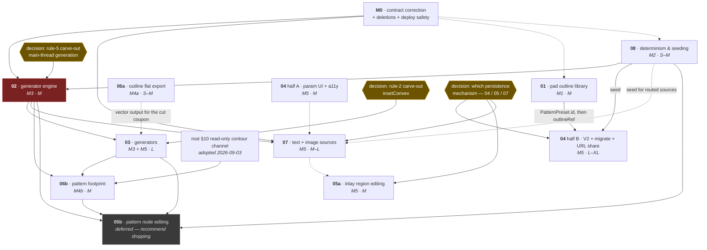

# GripSmith design docs — index

**Start here:** read [`00-architecture.md`](./00-architecture.md) first — it is the root, binding doc; every feature doc conforms to its §5 contracts and §5.2 rules, and it wins any conflict until amended. Then read [`_source/00-recon-report.md`](./_source/00-recon-report.md), the verified evidence base every claim in the set is cited against. Keep the report open beside whichever feature doc you are implementing.

`_source/` holds the verified evidence base — the recon report, the upstream build/test/typecheck baseline, and the preserved revision-1 architecture doc. **Do not hand-edit `_source/`.** Where a doc disagrees with it, the doc says so and cites a re-measurement (e.g. the `tsc` error count is 18, not the baseline's 19).

Every `file:line` citation is against upstream `master` @ `cf698036f28f86e4d70c00b24a2283b5ab7d3f49` on branch `gripsmith`. Line numbers drift the moment upstream moves — re-grep after any merge. The app is millimetre-based in three.js scene units at 1 unit = 1 mm; toolchain is pnpm 10.20.0 / Vite 5.4.21 / Vitest 2.1.9 / Tailwind 3.4.19 / React 19 with the React Compiler on.

---

## The set

| Doc | Purpose | Status | Milestone | Effort | Blocked by |
|---|---|---|---|---|---|
| [`00-architecture`](./00-architecture.md) | Root doc. The five contracts, the six rules, the real pipeline, the milestones, the §10 derivation rules and their read-only-contour-channel amendment. | Living / source-of-truth (rev 2) | defines **M0–M5** | — | — |
| [`01-pad-outline-library`](./01-pad-outline-library.md) | Hardening for the **already-shipping** 17-preset outline picker: stable `PatternPreset.id`, persisted `outlineRef`, provenance + `NOTICE`, `import.meta.env.BASE_URL` safety, zero-shape-DXF failure surfacing, thumbnail parse cache. | Ready to implement | **M1** (+ the `BASE_URL` half of M0) | M | Nothing in code. Off the critical path; only `PatternPreset.id` is a downstream dependency. |
| [`02-generator-engine`](./02-generator-engine.md) | Creates `ShapeSource` and `Generator
` + a lazy registry that writes `THREE.Shape[]` into `patternShapes` — the first production caller of `buildJob`'s `kind:'shapes'` branch. Reuses the existing worker; adds no job kind. | **Draft — blocked on one root-doc decision** | **M3** | M | **@liamstar's ruling on the rule-5 carve-out** (main-thread generation) before task 1 · M2 for `seed` · M0 for the deletions |
| [`03-generators`](./03-generators.md) | The four synthesis families — Voronoi, noise-contour, truchet/Wang, L-system — plus the vertex budget, the min-feature floor, and the tiler's missing cap. | Draft — ready to implement (task 2 gated) | **M3** (Voronoi) · **M5** (the rest) | L | M2 / doc 08 (the PRNG) · doc 02 (registry + param channel) · **§8 Q6's rule-2 amendment gates task 2** (`insetConvex`) |
| [`04-parametric-controls`](./04-parametric-controls.md) | Two features. **Half A:** descriptor-driven `ParamField` + `Slider` over the existing native Tailwind layer, and the first accessibility baseline. **Half B:** `ProjectSchemaV2` with a *working* migration, JSON-clean geometry, and a URL share carrying references + scalars + seed. | Design — ready to implement | **M5** | M (renderer) · L–XL (URL share) | Half A: **nothing**. Half B: M1 (`outlineRef`) + M2 (`seed`); `ProjectSchemaV2` itself is blocked on neither. |
| [`05-direct-editing`](./05-direct-editing.md) | **05a:** inlay region addressing, 3D pick, durable region edits, and the three lossy paint-modal defects. **05b:** pattern node/region editing — blocked, recommend dropping. | Draft. 05a buildable · **05b deferred, not scheduled** | **M5** | 05a M · 05b XL | §4.4 (lossy-edit fixes): nothing. §4.3 (persistence): **the three-way mechanism decision, §8 Q6**. 05b: a polygon representation for the pattern, which does not exist. |
| [`06-flat-export`](./06-flat-export.md) | The fork's second physical output: closed cut paths as an SVG document and an R12 DXF. **06a** exports the pad outline off the main thread; **06b** exports the pattern footprint through a read-only worker contour channel. | Ready to implement (06a) · Gated (06b) | **M4a** / **M4b** | 06a S–M · 06b M | 06a: nothing — shippable in parallel with M2/M3. 06b: the root §10 amendment (**adopted 2026-09-03**) + **M3** for a 2D pattern unit worth projecting. |
| [`07-text-image-sources`](./07-text-image-sources.md) | Wrap `traceImage` as a `ShapeSource`, extract the opentype producer out of the paint modal into `src/utils/text/`, self-host the 9 preset fonts, route both producers into the pattern lane, and close the persistence hole for shapes with no source file. | Draft | **M5** | M–L | M0 (cites the corrected §5) · doc 02 for the `ShapeSource` interface · doc 08 for §4.4 only |
| [`08-determinism-and-seeding`](./08-determinism-and-seeding.md) | The mulberry32 PRNG, `seed` on `GeometrySettingsSchema` + `InlayItemSchema` + `PatternJob`, and the tiler's 14th parameter. Removes the last three `Math.random()` calls. | Ready to implement | **M2** | S–M | **Nothing in code.** M0 touches no file this doc edits. |

**Revised phasing (root §6, §8):** `08 → 02 + one generator from 03`, in parallel with `06a` → `06b` (gated) → `04 → 07 → rest of 03 → 05a`. **01 is off the critical path entirely.** M0 is a doc-and-deletion milestone that precedes build work because eight child docs conform to §5.

---

## Blocking graph

Solid arrows are hard blocks. Dashed arrows are soft ordering (root §6 phasing). Hexagons are decisions **@liamstar** owes before the work they gate can start.

**Reading the graph.** Four docs can start today with no predecessor: **01**, **06a**, **08**, and **04**'s half A. The rest is ordinary sequencing (`08 → 02 → 03`, `01 → 04` half B) except for the three amber decisions, which are waiting on a person rather than a commit — **02 cannot begin at all until decision 1 is made.** Only `05b` is blocked on capabilities that do not exist: doc 05 §4.7 enumerates five preconditions, one of which (P3, stable per-region identity through `Manifold.compose`) is owned by nobody and would need a §10 amendment of its own. It is recommended for removal from the roadmap rather than carried as a phantom XL.

---

## Decisions outstanding

Four rulings gate work that is otherwise specified and ready. Each is recorded in the doc that needs it.

| # | Decision | Gates | Recorded in |
|---|---|---|---|
| 1 | Amend root §5.2 **rule 5** with a main-thread-synthesis carve-out, or overrule doc 02 §4.5 and re-scope it to a fourth worker kind (five edits). | doc 02, task 1 — i.e. all of M3 | doc 02 §3 (rule-5 row), §4.5 |
| 2 | Amend root §5.2 **rule 2** to permit `insetConvex`, a convex-only inward offset in JS, or reject it and redesign Voronoi's cell inset. | doc 03, task 2 | doc 03 §8 Q6 |
| 3 | Which of **three** competing persistence mechanisms for source-less geometry ships — doc 04 §4.3.1 (`ProjectSchemaV2.shapes.inlayShapes`), doc 05 §4.3 (`InlayItemSchema.editedShapes`), or doc 07 §4.5 (a synthetic `.shapes.json` zip asset). All three edit `src/components/Controls.tsx:206-231`; two declare the same new `SerializedShapeSchema`. | doc 05 §4.3, doc 07 §4.5, doc 04 §4.3.1's `shapes` block | doc 05 §8 Q6 · doc 04 §4.3.1 overlap notice · doc 07 §4.5 overlap notice |
| 4 | Two smaller doc-02 divergences from root §5.1: where `ShapeSource` lives, and whether "generalise `generateTilePositions`" is the right wording for `Generator
`. | wording only; no code is blocked | doc 02 §3, §4.2 |

Two further open questions are **product** calls, not blockers: root §11 Q1 (does the pattern slot stay single-source?) and doc 01 §8 Q2 (should there be a default pad?).

---

## How to add a doc

Follow root §10 — eight required elements, in order, ending with a task list that starts from the recon report's findings and **never** with "first, do recon". The §9 recon is complete; `_source/00-recon-report.md` is its output. Acceptance criteria must be checkable: a command, an assertion, or an observable outcome.
